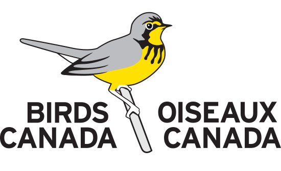

<!-- badges: start -->
[](https://birdscanada.r-universe.dev/)
[](https://birdscanada.r-universe.dev/motus)
[](https://github.com/MotusWTS/motus/actions/workflows/R-CMD-check.yaml)
[](https://app.codecov.io/gh/MotusWTS/motus?branch=main)

<!-- badges: end -->

# motus
<p align = "center">
  <a href = "https://www.birdscanada.org"></a>
  <a href = "https://motus.org"></a>
</p>

An R package for handling [Motus](https://motus.org) automated radio-telemetry data.

See the [motus package site](https://motuswts.github.io/motus/) for detailed usage information.


## Installation

The easiest way to install motus is from Birds Canada's [R-Universe](https://birdscanada.r-universe.dev):

```R
install.packages("motus", 
                 repos = c(birdscanada = 'https://birdscanada.r-universe.dev',
                           CRAN = 'https://cloud.r-project.org'))
```

If you want to check out work-in-progress, you can install the development 
branches (betaX and sandbox) using `remotes`.
```R
install.packages("remotes")                     # if don't already have it
remotes::install_github("motusWTS/motus@beta3") # the beta branch for v3+
```

> Running into problems? Check out the [Troubleshooting article](https://motuswts.github.io/motus/articles/troubleshooting.html)
