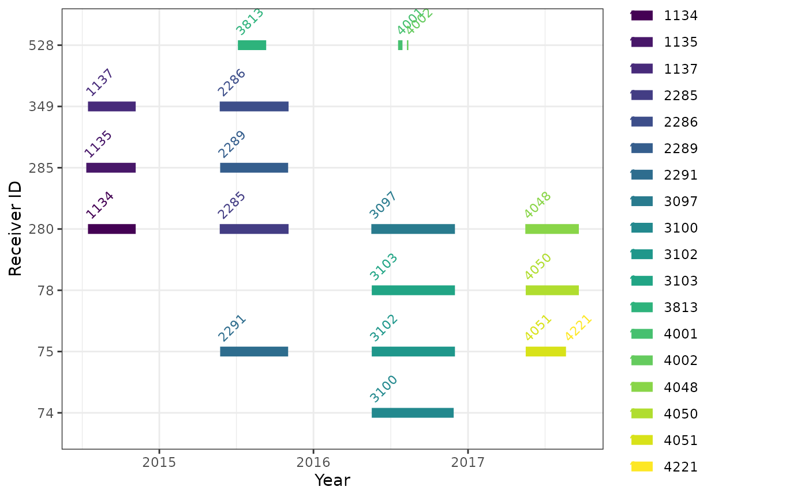
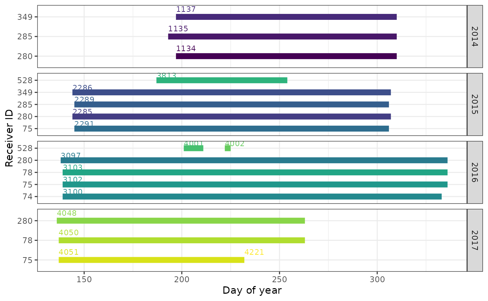
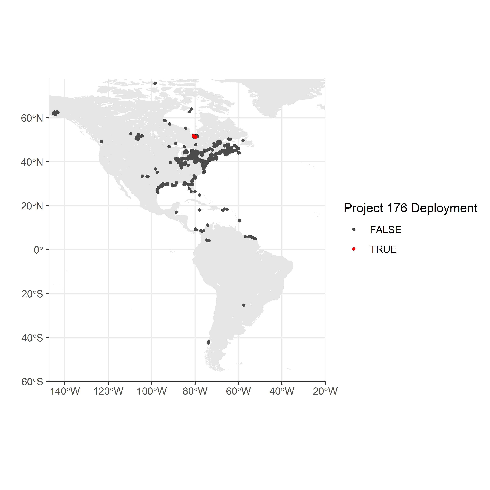
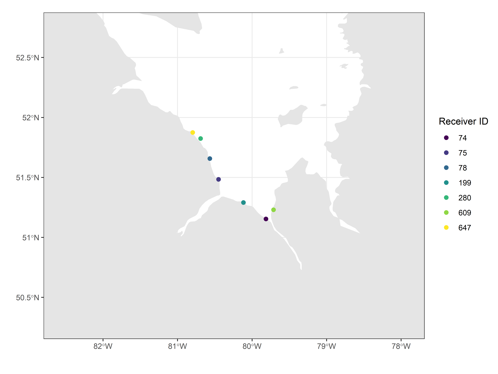

# Chapter 4 - Tag and receiver deployments

> In this chapter, we’ll go through checking retrieving and checking tag
> and receiver deployments. We’ll summarize and visualize as we go to
> check for problems before we start more detailed data cleaning in
> [Chapter
> 5](https://motuswts.github.io/motus/articles/05-data-cleaning.md).

Before working with your detection data, a first step is to summarize
and visualize the metadata for tag and receiver deployments registered
to your project. Summarizing and plotting your deployments can be an
effective way to find any errors in tag or receiver deployment metadata,
which can in turn influence the completeness of the detections data for
your project and the projects of others with detections of their own
tags on your receivers.

This chapter is a complement to the online ‘Data Issues’ page (visit the
[Motus website](https://motus.org/), log in and view the ‘Data Issues’
page under ‘Manage Data’), which provides each project with a list of
metadata issues (missing or outlying values) to be accepted or ignored.
As such, please address any and all errors associated with your project
on the ‘Data Issues’ page **before** importing your data through R. This
chapter does not provide a full check of your deployment metadata, but
will help uncover errors that have been missed by the automatic queries
on the ‘Data Issues’ page.

We use the James Bay Shorebird Project [sample
dataset](https://motuswts.github.io/motus/articles/01-introduction.html#sample-data)
throughout this chapter. As you run through the code to look at your own
deployments, **please fix any errors or omissions in your metadata by
signing in to <https://motus.org/>**, and under the ‘Manage Data’ tab,
select either ‘Manage Tags’ to fix tag deployment metadata or ‘Manage
Receivers’ to fix receiver deployment metadata. It is important to fix
metadata errors online, so that errors are fixed at the source and
archived on the Motus Server, ensuring all users have access to the
correct tag and receiver metadata. Metadata corrected online will
automatically be corrected in your detection files. If you have already
downloaded your detection data, you can update
[detections](https://motuswts.github.io/motus/articles/03-accessing-data.html#update-detections)
and
[metadata](https://motuswts.github.io/motus/articles/03-accessing-data.html#update-metadata).

## Setup

Before we begin working with data, we need to load the required packages
for this chapter. If you have not yet installed these packages (from
GitHub or CRAN) then please return to [Chapter 2 - Installing
packages](https://motuswts.github.io/motus/articles/02-installing-packages.md).

``` r
library(tidyverse)
library(motus)
library(lubridate)
library(rnaturalearth)
library(sf)

# Set the system environment time zone to UTC (to ensure that you are always working in UTC)
Sys.setenv(TZ = "UTC")
```

## Load `.motus` file

This chapter assumes that the `.motus` file has already been downloaded,
if you have not done so please return to [Chapter 3 - Accessing
detections
data](https://motuswts.github.io/motus/articles/03-accessing-data.md).
To update and load the existing file into R, use
[`tagme()`](https://motuswts.github.io/motus/reference/tagme.md), you
may have to
[login](https://motuswts.github.io/motus/articles/03-accessing-data.html#user-authentication)
with the username **and** password ‘motus.sample’.

``` r
sql_motus <- tagme(176, dir = "./data")
```

    ## Checking for new data in project 176

    ## Updating metadata

    ## activity:     1 new batch records to check

    ## batchID  1977125 (#     1 of      1): got    156 activity records

    ## Downloaded 156 activity records

    ## nodeData:     0 new batch records to check

    ## Fetching deprecated batches

    ## Total deprecated batches: 6
    ## New deprecated batches: 0

## Tag deployments

In your `.motus` file, when using the `tagme` function, you are only
provided with the metadata for any tags from your project with
detections along with metadata for associated ambiguous tags from other
projects, and receiver metadata for stations where your tags were
detected.

Here we will:

1.  download full tag metadata for our project only
2.  determine how many tags are registered to your project
3.  determine how many of those registered tags were deployed
4.  determine location of tag deployments
5.  determine completeness and accuracy of tag deployment metadata

We will run through each of these in sequence.

### Download full project tag metadata

Incomplete metadata or missing tag registrations can result in missing
detection data. We therefore want to assess the completeness of all tags
registered to our projects - not just tags for which we have detections.
In order to to this we will use the
[`metadata()`](https://motuswts.github.io/motus/reference/metadata.md)
function for project 176, described in more detail in [Chapter
3](https://motuswts.github.io/motus/articles/03-accessing-data.html#all-metadata).

``` r
metadata(sql_motus, projectIDs = 176)
```

### Number of registered tags

Now that we have complete tag metadata for our project, we can check the
number of tags registered by loading the `tags` table in the `.motus`
file. The `tags` table contains the metadata of each registered tag,
including a unique tagID and information on manufacturer, model, nominal
and offset frequency, burst interval, and pulse length. The `tags` table
does not include deployment information. We select the metadata specific
to the James Bay Shorebird Project, and ignore tag metadata associated
with any duplicate tags belonging to other projects:

``` r
tbl_tags <- tbl(sql_motus, "tags") 
df_tags <- tbl_tags %>%
  filter(projectID == 176) %>%
  collect() %>%
  as.data.frame()
```

The number of rows in the `df_tags` database is equivalent to the number
of tags registered to the James Bay Shorebird Project in the sample
dataset (i.e., 18 tags):

``` r
nrow(df_tags) # number of registered tags in the database
```

    ## [1] 18

You can view the motusTagIDs:

``` r
unique(df_tags$tagID)
```

    ##  [1] 16011 16035 16036 16037 16038 16039 16044 16047 16048 16052 17357 19129
    ## [13] 22867 22897 22902 22905 23316 23319

If you are missing registered tags, please follow the instructions at
<https://motus.org/tag-registration/>.

### Number of registered tags that were deployed

The tag deployment metadata table (`tagDeps`) in the `.motus` file is
required to check which registered tags have deployments. This file
includes the date, time, species, and location of tag deployment. The
database is subset to project ‘176’, and we use the
[`anti_join()`](https://dplyr.tidyverse.org/reference/filter-joins.html)
function to determine which registered tags have (or do not have)
corresponding deployment information.

``` r
tbl_tagDeps <- tbl(sql_motus, "tagDeps") 

df_tagDeps <- tbl_tagDeps %>%
  filter(projectID == 176) %>%
  collect() %>%
  as.data.frame() %>% # once in df format, can format dates with lubridate
  mutate(timeStart = as_datetime(tsStart),
         timeEnd = as_datetime(tsEnd)) 

anti_join(df_tags, df_tagDeps, by = "tagID") 
```

    ##  [1] tagID        projectID    mfgID        type         codeSet     
    ##  [6] manufacturer model        lifeSpan     nomFreq      offsetFreq  
    ## [11] bi           pulseLen    
    ## <0 rows> (or 0-length row.names)

In the sample data, there are no registered tags without deployment
metadata, which suggests that all tags were deployed. If you have
undeployed tags in your own files, please check your records to ensure
this is the case; without deployment metadata, detections for registered
but ‘undeployed’ tags will be missing from your detections database.

### Number of deployments per tag

A tag might be deployed more than once, for example, if a previously
deployed tag was recovered, and then later re-deployed on another
individual. When tags are deployed more than once, the detections data
should be considered independently for each deployment.

Throughout these articles we use the `motusTagID` as a unique identifier
for a deployment. However, when a tag is deployed more than once, the
`motusTagID` will remain consistent between deployments, and we instead
need to use the `tagDeployID`, or combination of `motusTagID` and
`tagDeployID` to distinguish which detections belong to which
deployment.

Here, we check whether there are any tags with more than one deployment
in the sample data (there are none), and then show you how to make a
combined `motusTagID`/`tagDeployID` variable to use in place of the
`motusTagID` if you have multiple deployments of a tag in your own data:

``` r
df_alltags <- tbl(sql_motus, "alltags") %>% 
  collect() %>% 
  as.data.frame() %>%     # for all fields in the df (data frame)
  mutate(time = as_datetime(ts))

df_alltags %>%
  select(motusTagID, tagDeployID) %>%
  filter(!(is.na(tagDeployID))) %>% # remove NA tagDeployIDs
  distinct() %>%
  group_by(motusTagID) %>%
  mutate(n = n()) %>%
  filter(n > 1)
```

    ## # A tibble: 0 × 3
    ## # Groups:   motusTagID [0]
    ## # ℹ 3 variables: motusTagID <int>, tagDeployID <int>, n <int>

If you do have multiple deployments for a tag, we recommend creating a
`motusTagDepID` to use in place of the `motusTagID` to define unique
deployments of a tag. Moving forward, you would use `motusTagDepID` in
place of `motusTagID` as you work through the rest of these articles:

``` r
df_alltags <- df_alltags %>%
  mutate(motusTagDepID = paste(motusTagID, tagDeployID, sep = "."))

# and do the same for the tag metadata
df_tagDeps <- df_tagDeps %>%
  mutate(motusTagDepID = paste(tagID, deployID, sep = "."))
```

### Location of tag deployments

Creating a map of your tag deployments can point out any obvious errors
in the tag deployment latitude or longitude that weren’t captured by the
online metadata message centre queries.

**a. Load base map files**

Load base map files from the `rnaturalearth` package. You will need to
have the `rgdal` and `rgeos` packages installed. The first time you run
this code, you will need to download the `lakes` shapefiles. Like the
`tagme` function, the `destdir` argument allows you to specify the
directory where you would like to save these files; we have created a
`map-data` folder within our working directory in this example:

``` r
world <- ne_countries(scale = "medium", returnclass = "sf") 
# only need this first time downloading
lakes <- ne_download(scale = "medium", type = 'lakes', category = 'physical',
                     returnclass = "sf", destdir = "map-data", load = FALSE) 
```

You only need to download the spatial files once. If you return to an
analysis later and run code again, you can use the `ne_load` function
because the spatial files are already stored on your computer:

``` r
lakes <- ne_load(type = "lakes", scale = "medium", category = 'physical',
                 returnclass = "sf", destdir = "map-data")
```

**b. Map the locations of tag deployments**

Map the location of tag deployments for the sample data:

``` r
# set limits to map based on locations of detections, ensuring they include the
# deployment locations
xmin <- -100 #min(df_tagDeps$longitude, na.rm = TRUE) - 5
xmax <- max(df_tagDeps$longitude, na.rm = TRUE) + 5
ymin <- min(df_tagDeps$latitude, na.rm = TRUE) - 5
ymax <- max(df_tagDeps$latitude, na.rm = TRUE) + 5
                
# map using ggplot and sf
ggplot(data = world) + 
  geom_sf(colour = NA) +
  geom_sf(data = lakes, colour = NA, fill = "white") +
  coord_sf(xlim = c(xmin, xmax), ylim = c(ymin, ymax), expand = FALSE) +
  labs(x = "", y = "") + 
  theme_bw() + 
  geom_point(data = filter(df_tagDeps, projectID == 176), 
             aes(longitude, latitude), size = 2, shape = 19, colour = "red")
```


If there are any errors in tag deployment location, please correct these
online at <https://motus.org/data/>.

### Check completeness and accuracy of tag deployment metadata

Required tag metadata includes deployment start date/time, end date/time
(if applicable), deployment latitude, deployment longitude, and species.
Lack of information on deployment date, time, and location in particular
can influence the estimated lifespan of your tag, and therefore whether
the `tagFinder` will ‘look’ for your tag at the appropriate time(s). It
can also increase the potential for ambiguities with duplicate tags in
the system.

**a. Look at range of metadata values**

As a first step, use `summary(df_tagDeps)` to get an idea of the range
of each variable, and whether any variables have missing (`NA`) or odd
values. The following summarizes a subset of the variables in the
`df_tagDeps` database. There are several things to consider: are the
range of start and end dates reasonable for your deployments, or are
there obvious errors in the timing of deployments? Is the range in
deployment latitude and longitude reasonable? Are the values for
`speciesID` correct?

``` r
df_tagDeps %>%
  select(tagID, projectID, timeStart, timeEnd, speciesID, latitude, longitude) %>%
  summary()
```

    ##      tagID         projectID     timeStart                  
    ##  Min.   :16011   Min.   :176   Min.   :2015-08-02 11:40:00  
    ##  1st Qu.:16038   1st Qu.:176   1st Qu.:2015-08-13 15:25:00  
    ##  Median :16050   Median :176   Median :2015-09-10 17:50:30  
    ##  Mean   :18616   Mean   :176   Mean   :2016-01-24 12:49:36  
    ##  3rd Qu.:22890   3rd Qu.:176   3rd Qu.:2016-09-25 15:34:15  
    ##  Max.   :23319   Max.   :176   Max.   :2016-10-15 16:00:00  
    ##     timeEnd                      speciesID       latitude       longitude     
    ##  Min.   :2015-12-17 11:40:00   Min.   :4180   Min.   :50.19   Min.   :-80.69  
    ##  1st Qu.:2015-12-28 15:25:00   1st Qu.:4670   1st Qu.:50.52   1st Qu.:-80.45  
    ##  Median :2016-03-10 17:50:30   Median :4690   Median :51.48   Median :-80.45  
    ##  Mean   :2016-07-28 18:09:36   Mean   :4674   Mean   :51.18   Mean   :-75.85  
    ##  3rd Qu.:2017-06-06 09:53:45   3rd Qu.:4690   3rd Qu.:51.48   3rd Qu.:-67.92  
    ##  Max.   :2017-06-26 16:00:00   Max.   :4820   Max.   :51.80   Max.   :-63.75

There are no missing start dates (`timeStart`), and deployment start
dates range from 2015 to 2016, which is reasonable for this project.

The `speciesID`s are numeric, and somewhat meaningless without an
ability to assign an actual species name to the numeric ID, which we do
next, however there are no missing values.

**b. Check that `speciesID`s are appropriate for your data**

The `species` table in the `.motus` file associates each numeric
`speciesID` with an English, French, and scientific name. We load that
table, and subset to the suite of numeric `speciesID`s in the tag
metadata:

``` r
# generate list of species IDs in project 176 metadata
sp.list <- unique(df_tagDeps$speciesID)  

# Species metadata
tbl_species <- tbl(sql_motus, "species") 
tbl_species %>%
  filter(id %in% sp.list) %>%
  collect() %>%
  as.data.frame()
```

    ##     id                english                       french
    ## 1 4180    Semipalmated Plover            Pluvier semipalmé
    ## 2 4670               Red Knot           Bécasseau maubèche
    ## 3 4680             Sanderling         Bécasseau sanderling
    ## 4 4690 Semipalmated Sandpiper          Bécasseau semipalmé
    ## 5 4760 White-rumped Sandpiper   Bécasseau à croupion blanc
    ## 6 4780     Pectoral Sandpiper Bécasseau à poitrine cendrée
    ## 7 4820                 Dunlin           Bécasseau variable
    ##                scientific group sort
    ## 1 Charadrius semipalmatus BIRDS   NA
    ## 2        Calidris canutus BIRDS   NA
    ## 3           Calidris alba BIRDS   NA
    ## 4        Calidris pusilla BIRDS   NA
    ## 5    Calidris fuscicollis BIRDS   NA
    ## 6      Calidris melanotos BIRDS   NA
    ## 7         Calidris alpina BIRDS   NA

This lists all species that are included in the tag deployment metadata
for the project. If there are species that do not make sense, this is
likely due to a data entry error when assigning a deployment to a
species. You can look for records in your tag metadata that are
associated with a particular `speciesID` using the following code; you
would then use the `deployID` associated with the entry/entries to find
and update the deployment record in your project metadata online:

``` r
filter(df_tagDeps, speciesID == 4780)
```

    ##   tagID deployID projectID    tsStart      tsEnd deferSec speciesID markerType
    ## 1 22867    10517       176 1473176100 1495121700       NA      4780 metal band
    ##   markerNumber  sex  age latitude longitude elevation
    ## 1   2641-20877 <NA> <NA> 51.79861 -80.69139        NA
    ##                                                                                                                                                                                                                                                                                               comments
    ## 1 Sex:F, Age:HY, Bill28, Tarsus:26.2, Wing Chord:123, Wing Flat:129, Mass:57.7, Flag: (FEW)7P6, Blood:Y, Canada, Ontario, James Bay, LONGRIDGE, Comments: REKN tag on mesh; has a duplicate tag same burst rate 380-272 a HY REKN banded at Mingan Islands on 02-Oct-2016 and band number 9822-53171\n
    ##   test attachment tsStartCode tsEndCode bandNumber id bi
    ## 1   NA       <NA>          1L        3L       <NA> NA NA
    ##                                 fullID status           timeStart
    ## 1 SampleData#272.1:5.3@166.38(M.22867)   <NA> 2016-09-06 15:35:00
    ##               timeEnd motusTagDepID
    ## 1 2017-05-18 15:35:00   22867.10517

**Please remember, any metadata corrections need to be made
[online](https://www.motus.org).**

## Check receiver metadata

There are two sources of receiver metadata in Motus detection data:
receivers registered to your own project, and receivers registered to
the projects of others. You can access metadata for all receivers in the
network, because negative data (i.e., my tag was *not* detected at
station X even though station X was active) is often as important as
positive data. It also allows you to map where your tags were detected
relative to the distribution of receivers throughout the Motus network.

Receiver metadata errors or omissions that you find in your `.motus`
file can only be fixed for receivers registered to your own project.

All users are encouraged to enter complete and accurate receiver
metadata for the benefit of the entire network. If you anticipate
needing specific information on receiver or antenna deployments for
stations deployed by others, please consider using the [Motus discussion
group](https://groups.google.com/g/motus-wts) to request that other
registered users record the receiver deployment details you will need;
be specific about the exact receiver deployment details you are
interested in, and when and where in the network your tags will be
deployed and potentially detected.

In the following steps we will:

1.  download full receiver metadata across the network
2.  determine number of project receiver deployments
3.  determine timing of project receiver deployments
4.  determine location of network-wide and project receiver deployments
5.  determine completeness and accuracy of receiver metadata

### Download full receiver metadata

Later on in this chapter we will want to map all receivers in the
network, so we will now load metadata from all projects, as opposed to
simply project 176 as we did above. The
[`metadata()`](https://motuswts.github.io/motus/reference/metadata.md)
function is described in more detail in [Chapter
3](https://motuswts.github.io/motus/articles/03-accessing-data.html#all-metadata).

``` r
metadata(sql_motus)
```

### Number of project receiver deployments

To see which (if any) receiver deployments are registered to your
project, import, subset and summarize the receiver deployment data:

``` r
tbl_recvDeps <- tbl(sql_motus, "recvDeps") 

df_projRecvs <- tbl_recvDeps %>%
  filter(projectID == 176) %>%
  collect() %>%
  as.data.frame() %>%
  mutate(timeStart = as_datetime(tsStart),
         timeEnd = as_datetime(tsEnd))

summary(df_projRecvs)
```

    ##     deployID      projectID      serno           receiverType      
    ##  Min.   :1134   Min.   :176   Length:18          Length:18         
    ##  1st Qu.:2287   1st Qu.:176   Class :character   Class :character  
    ##  Median :3101   Median :176   Mode  :character   Mode  :character  
    ##  Mean   :2952   Mean   :176                                        
    ##  3rd Qu.:4002   3rd Qu.:176                                        
    ##  Max.   :4221   Max.   :176                                        
    ##                                                                    
    ##     deviceID         status              name             siteName        
    ##  Min.   : 74.00   Length:18          Length:18          Length:18         
    ##  1st Qu.: 75.75   Class :character   Class :character   Class :character  
    ##  Median :280.00   Mode  :character   Mode  :character   Mode  :character  
    ##  Mean   :250.11                                                           
    ##  3rd Qu.:333.00                                                           
    ##  Max.   :528.00                                                           
    ##                                                                           
    ##  stationName        fixtureType           latitude       longitude     
    ##  Length:18          Length:18          Min.   :51.15   Min.   :-80.80  
    ##  Class :character   Class :character   1st Qu.:51.48   1st Qu.:-80.63  
    ##  Mode  :character   Mode  :character   Median :51.66   Median :-80.57  
    ##                                        Mean   :51.58   Mean   :-80.47  
    ##                                        3rd Qu.:51.74   3rd Qu.:-80.45  
    ##                                        Max.   :51.88   Max.   :-79.81  
    ##                                        NA's   :3       NA's   :3       
    ##    elevation        isMobile         tsStart              tsEnd          
    ##  Min.   :-7.00   Min.   :0.0000   Min.   :1.405e+09   Min.   :1.415e+09  
    ##  1st Qu.:-6.25   1st Qu.:0.0000   1st Qu.:1.432e+09   1st Qu.:1.445e+09  
    ##  Median :-5.50   Median :0.0000   Median :1.463e+09   Median :1.458e+09  
    ##  Mean   :-5.50   Mean   :0.1667   Mean   :1.454e+09   Mean   :1.459e+09  
    ##  3rd Qu.:-4.75   3rd Qu.:0.0000   3rd Qu.:1.470e+09   3rd Qu.:1.481e+09  
    ##  Max.   :-4.00   Max.   :1.0000   Max.   :1.503e+09   Max.   :1.503e+09  
    ##  NA's   :16                                           NA's   :2          
    ##    utcOffset     stationID    macAddress          timeStart                  
    ##  Min.   : NA   Min.   : NA   Length:18          Min.   :2014-07-12 00:00:00  
    ##  1st Qu.: NA   1st Qu.: NA   Class :character   1st Qu.:2015-05-24 06:00:00  
    ##  Median : NA   Median : NA   Mode  :character   Median :2016-05-17 12:00:00  
    ##  Mean   :NaN   Mean   :NaN                      Mean   :2016-01-23 14:03:16  
    ##  3rd Qu.: NA   3rd Qu.: NA                      3rd Qu.:2016-08-04 01:26:15  
    ##  Max.   : NA   Max.   : NA                      Max.   :2017-08-20 23:30:00  
    ##  NA's   :18    NA's   :18                                                    
    ##     timeEnd                   
    ##  Min.   :2014-11-06 00:00:00  
    ##  1st Qu.:2015-10-20 00:00:00  
    ##  Median :2016-03-16 21:05:00  
    ##  Mean   :2016-03-25 17:06:15  
    ##  3rd Qu.:2016-12-01 00:00:00  
    ##  Max.   :2017-08-20 23:30:00  
    ##  NA's   :2

There are 18 receiver deployments registered to the sample project. Four
deployments are missing latitude and longitude, and six deployments are
missing end dates, which suggests that those receivers are still
deployed.

The following code keeps only variables of interest (by removing those
we do not need), and arranges the remaining records by receiver ID,
latitude, and start date:

``` r
df_projRecvs %>%
  mutate(dateStart = date(timeStart)) %>% 
  select(-serno,-fixtureType, -macAddress, -timeStart, -timeEnd, -elevation, 
         -projectID, -status, -receiverType, -siteName) %>%
  arrange(deviceID, latitude, dateStart)
```

    ##    deployID deviceID             name stationName latitude longitude isMobile
    ## 1      3100       74       Washkaugou        <NA>  51.1540  -79.8144        0
    ## 2      2291       75      North Bluff        <NA>  51.4839  -80.4500        0
    ## 3      3102       75      North Bluff        <NA>  51.4839  -80.4501        0
    ## 4      4051       75      North Bluff        <NA>  51.4839  -80.4501        0
    ## 5      4221       75      North Bluff        <NA>  51.4839  -80.4501        0
    ## 6      3103       78       Piskwamish        <NA>  51.6579  -80.5678        0
    ## 7      4050       78       Piskwamish        <NA>  51.6580  -80.5679        0
    ## 8      1134      280        Longridge        <NA>  51.8230  -80.6911        0
    ## 9      2285      280        Longridge        <NA>  51.8231  -80.6912        0
    ## 10     3097      280        Longridge        <NA>  51.8244  -80.6909        0
    ## 11     4048      280    Halfway Point        <NA>  51.8753  -80.7973        0
    ## 12     1135      285        Netitishi        <NA>  51.2913  -80.1167        0
    ## 13     2289      285        Netitishi        <NA>  51.2913  -80.1168        0
    ## 14     2286      349       Piskwamish        <NA>  51.6578  -80.5676        0
    ## 15     1137      349       Piskwamish        <NA>  51.6582  -80.5669        0
    ## 16     3813      528        NP mobile        <NA>       NA        NA        1
    ## 17     4001      528 BurntPointAerial        <NA>       NA        NA        1
    ## 18     4002      528   JamesBayAerial        <NA>       NA        NA        1
    ##       tsStart      tsEnd utcOffset stationID  dateStart
    ## 1  1463529600 1480291200        NA        NA 2016-05-18
    ## 2  1432512000 1446422400        NA        NA 2015-05-25
    ## 3  1463529600 1480550400        NA        NA 2016-05-18
    ## 4  1495033200 1503271800        NA        NA 2017-05-17
    ## 5  1503271800 1503271800        NA        NA 2017-08-20
    ## 6  1463529600 1480550400        NA        NA 2016-05-18
    ## 7  1495034340         NA        NA        NA 2017-05-17
    ## 8  1405468800 1415232000        NA        NA 2014-07-16
    ## 9  1432425600 1446508800        NA        NA 2015-05-24
    ## 10 1463443200 1480550400        NA        NA 2016-05-17
    ## 11 1494950100         NA        NA        NA 2017-05-16
    ## 12 1405123200 1415232000        NA        NA 2014-07-12
    ## 13 1432512000 1446422400        NA        NA 2015-05-25
    ## 14 1432425600 1446508800        NA        NA 2015-05-24
    ## 15 1405468800 1415232000        NA        NA 2014-07-16
    ## 16 1436140800 1441929600        NA        NA 2015-07-06
    ## 17 1468915200 1469815800        NA        NA 2016-07-19
    ## 18 1470726900 1471019400        NA        NA 2016-08-09

The number of receiver deployments in the metadata should correspond
with the number of field deployments.

Looking at the `isMobile` column for the four receiver deployments that
are missing latitude and longitude information, it is evident that these
are mobile receivers that do not have a fixed position (i.e. they have a
value of 1). Because they are mobile, coordinates of the deployment
aren’t expected, and in this case will remain `NA`. Receiver deployment
coordinates for mobile receivers, when present, are meant to represent
the starting point for the deployment.

### Timing of project receiver deployments

The timing of deployments can be displayed graphically; horizontal
line(s) in the following plot show the time span for each receiver
(`deviceID`) deployment registered to the James Bay Shorebird Project.
Note that for the two receivers without deployment end dates, the code
assigns an arbitrary end date based on the maximum end date of the other
receivers plus one month - without this fix, deployments without end
dates do not get displayed. Different deployments of the same receiver
should not overlap in time:

``` r
# put data in long format to simplify plotting (or use geom_segment)
df_projRecvs.long <- df_projRecvs %>%
  select(deviceID, deployID, timeStart, timeEnd) %>% 
  gather(when, time, c(timeStart, timeEnd)) %>%
  # fake end date:
  mutate(time = if_else(is.na(time), max(time, na.rm = TRUE) + duration(1, "month"), time)) 

ggplot(data = df_projRecvs.long, 
       aes(x = time, y = as.factor(deviceID), colour = as.factor(deployID))) +
  theme(legend.position = "none") +
  geom_line(lwd = 3) + 
  # instead, centre to the right
  geom_text(data = filter(df_projRecvs.long, when == "timeStart"), 
            aes(label = deployID), hjust = "left", nudge_y = 0.2, size = 3, angle = 45) +
  scale_color_viridis_d() +
  theme_bw() +
  labs(x = "Year", y = "Receiver ID")
```



If you want more detail for a given year (or all years) you can either
subset and re-plot, or use the day of year on the x-axis, and
[`facet_wrap()`](https://ggplot2.tidyverse.org/reference/facet_wrap.html)
by year.

``` r
ggplot(data = df_projRecvs.long, 
       aes(x = yday(time), y = as.factor(deviceID), colour = as.factor(deployID))) +
  theme_bw() +
  theme(legend.position = "none") + 
  geom_line(lwd = 3) + 
  # centre labels to the left
  geom_text(data = filter(df_projRecvs.long, when == "timeStart"), 
            aes(label = deployID), hjust = "left", nudge_y = 0.4, size = 3) +
  labs(x = "Day of year", y = "Receiver ID") +
  facet_grid(year(time) ~ ., scales = "free") +
  scale_color_viridis_d()
```



### Location of receiver deployments

Maps provide better spatial context than simple plots; the following
steps plot the location of Motus receivers on a map of North America,
with receivers deployed by the sample project displayed in red.

**a. Load all receiver metadata**

``` r
df_recvDeps <- tbl_recvDeps %>%
  collect() %>%
  as.data.frame() %>%
  mutate(timeStart = as_datetime(tsStart),
         timeEnd = as_datetime(tsEnd))
```

**b. Load base map files**

``` r
# include all of the Americas to begin
world <- ne_countries(scale = "medium", returnclass = "sf") 

lakes <- ne_load(type = "lakes", scale = "medium", category = 'physical',
                 returnclass = "sf",
                 destdir = paste0(getwd(), "./map-data")) # use this if already downloaded shapefiles
```

**c. Map the location of receivers in the Americas** Map showing the
location of network-wide receivers (dark grey points) and receivers
deployed by the James Bay Shorebird Project (project 176; red points).

``` r
# set map limits using detection locations; 
# ensure they include the deployment locations
xmin <- min(df_recvDeps$longitude, na.rm = TRUE) - 2
xmax <- -20 # restrict to the Americas (excluding a few points in Europe)
ymin <- -60 #min(df_recvDeps$longitude, na.rm = TRUE) - 2
ymax <- max(df_recvDeps$latitude, na.rm = TRUE) + 2
                
# map
ggplot(data = world) + 
  geom_sf(colour = NA) +
  geom_sf(data = lakes, colour = NA, fill = "white") +
  coord_sf(xlim = c(xmin, xmax), ylim = c(ymin, ymax), expand = FALSE) +
  labs(x = "", y = "") + 
  theme_bw() +  
  geom_point(data = df_recvDeps, 
             aes(longitude, latitude, colour = as.logical(projectID == 176)), 
             size = 0.8, shape = 19) +
  scale_colour_manual(values = c("grey30", "red"), name = "Project 176 Deployment") 
```



**d. Map the location of project specific receivers only**

Map of project-specific receivers, created by setting the x-axis
(longitude) and y-axis (latitude) map limits using the `df_projRecvs`
dataframe created above. Deployments are restricted to those that were
active at in 2016.

``` r
# get a higher resolution basemap for the James Bay region
region <- ne_states(country = "Canada", returnclass = "sf") %>% 
  filter(name %in% c("Ontario", "Québec", "Nunavut"))

# set map limits using detection locations;
# ensure they include the deployment locations
xmin <- min(df_projRecvs$longitude, na.rm = TRUE) - 2
xmax <- max(df_projRecvs$longitude, na.rm = TRUE) + 2
ymin <- min(df_projRecvs$latitude, na.rm = TRUE) - 1
ymax <- max(df_projRecvs$latitude, na.rm = TRUE) + 1
                
# map
ggplot(data = region) + 
  geom_sf(colour = NA) +
  geom_sf(data = lakes, colour = NA, fill = "white") +
  coord_sf(xlim = c(xmin, xmax), ylim = c(ymin, ymax), expand = FALSE) +
  labs(x = "", y = "") + 
  theme_bw() +  
  labs(x = "", y = "") +
  geom_point(data = filter(df_projRecvs, 
                           year(timeStart) == 2016, 
                           !is.na(latitude)),  # remove mobile receivers
             aes(longitude, latitude, colour = as.factor(deviceID)), size = 2, shape = 19)+
  scale_colour_viridis_d(name = "Receiver ID") 
```



### Completeness and accuracy of receiver metadata

Motus users will be concerned primarily with the completeness of
metadata for receiver deployments with detection(s) of their tags,
because these can directly influence the interpretation of those
detections. For example, missing deployment latitude or longitude will
result in an unknown location for the tag detection, and missing
information on antenna type and/or orientation can impede the estimation
of flight or departure orientation.

In many cases, however, metadata for receiver deployments *without* tag
detections can also be useful, for example to estimate probability of
detecting an animal that passes within range of a station.

In this section, the focus is on metadata for receivers registered to a
particular project. Depending on your interests, these summaries can be
applied to a larger group of receivers, e.g., all receivers with
detections or all receivers within certain geographic limits (with or
without detections).

**a. Load receiver and antenna metadata**

``` r
# antenna metadata for ALL Motus antenna deployments; 
# to simplify, keep only the variables of interest.
tbl_antDeps <- tbl(sql_motus, "antDeps") 

df_antDeps <- tbl_antDeps %>%
  select(deployID, port, antennaType, bearing, heightMeters) %>%
  collect() %>%
  as.data.frame()

# receiver deployments; select variables of interest
df_recvDeps <- df_recvDeps %>%
  select(deployID, receiverType, deviceID, name, latitude, longitude, 
         isMobile, timeStart, timeEnd, projectID, elevation) 

df_stationDeps <- left_join(df_recvDeps, df_antDeps, by = "deployID")
```

Subset these to receivers registered to a project:

``` r
df_stationDeps <- filter(df_stationDeps, projectID == 176)
```

**b. Look at range of metadata values**

Use [`summary()`](https://rdrr.io/r/base/summary.html) to get a general
idea of the distribution of the variables in the data.

``` r
summary(df_stationDeps)
```

    ##     deployID    receiverType          deviceID         name          
    ##  Min.   :1134   Length:55          Min.   : 74.0   Length:55         
    ##  1st Qu.:2286   Class :character   1st Qu.: 75.0   Class :character  
    ##  Median :3100   Mode  :character   Median :280.0   Mode  :character  
    ##  Mean   :2919                      Mean   :201.3                     
    ##  3rd Qu.:4048                      3rd Qu.:285.0                     
    ##  Max.   :4221                      Max.   :528.0                     
    ##                                                                      
    ##     latitude       longitude         isMobile      
    ##  Min.   :51.15   Min.   :-80.80   Min.   :0.00000  
    ##  1st Qu.:51.48   1st Qu.:-80.60   1st Qu.:0.00000  
    ##  Median :51.66   Median :-80.57   Median :0.00000  
    ##  Mean   :51.57   Mean   :-80.46   Mean   :0.05455  
    ##  3rd Qu.:51.70   3rd Qu.:-80.45   3rd Qu.:0.00000  
    ##  Max.   :51.88   Max.   :-79.81   Max.   :1.00000  
    ##  NA's   :3       NA's   :3                         
    ##    timeStart                      timeEnd                      projectID  
    ##  Min.   :2014-07-12 00:00:00   Min.   :2014-11-06 00:00:00   Min.   :176  
    ##  1st Qu.:2015-05-24 00:00:00   1st Qu.:2015-11-02 00:00:00   1st Qu.:176  
    ##  Median :2016-05-18 00:00:00   Median :2016-10-05 08:15:00   Median :176  
    ##  Mean   :2016-02-22 12:28:39   Mean   :2016-05-04 00:08:20   Mean   :176  
    ##  3rd Qu.:2017-05-16 15:55:00   3rd Qu.:2016-12-01 00:00:00   3rd Qu.:176  
    ##  Max.   :2017-08-20 23:30:00   Max.   :2017-08-20 23:30:00   Max.   :176  
    ##                                NA's   :7                                  
    ##    elevation          port           antennaType           bearing      
    ##  Min.   :-7.000   Length:55          Length:55          Min.   : 10.00  
    ##  1st Qu.:-7.000   Class :character   Class :character   1st Qu.: 66.25  
    ##  Median :-7.000   Mode  :character   Mode  :character   Median :145.00  
    ##  Mean   :-5.714                                         Mean   :151.34  
    ##  3rd Qu.:-4.000                                         3rd Qu.:215.00  
    ##  Max.   :-4.000                                         Max.   :357.50  
    ##  NA's   :48                                             NA's   :11      
    ##   heightMeters 
    ##  Min.   :5.60  
    ##  1st Qu.:5.60  
    ##  Median :5.80  
    ##  Mean   :5.85  
    ##  3rd Qu.:6.00  
    ##  Max.   :6.20  
    ##  NA's   :3

There are the 4 deployments with missing latitude and longitude
associated with the four deployments of mobile receivers that we saw
earlier.

Elevation is missing from 74 of 91 records, but elevation is not a
required field, and can be estimated from other sources, or directly in
R ([see
example](https://stackoverflow.com/questions/8973695/conversion-for-latitude-longitude-to-altitude-in-r)).

Antenna bearing is missing from 18 of 91 records, and height of the
antenna(s) is missing for 4 of 91 records. Subset the records with
missing antenna bearing to see if these can be fixed:

``` r
df_stationDeps %>%
  filter(is.na(bearing)) %>%
  select(-elevation, -deviceID, -timeEnd)
```

    ##    deployID receiverType             name latitude longitude isMobile
    ## 1      3097  SENSORGNOME        Longridge  51.8244  -80.6909        0
    ## 2      3100  SENSORGNOME       Washkaugou  51.1540  -79.8144        0
    ## 3      3102  SENSORGNOME      North Bluff  51.4839  -80.4501        0
    ## 4      3103  SENSORGNOME       Piskwamish  51.6579  -80.5678        0
    ## 5      3813  LOTEKSRX800        NP mobile       NA        NA        1
    ## 6      4001  LOTEKSRX800 BurntPointAerial       NA        NA        1
    ## 7      4002  LOTEKSRX800   JamesBayAerial       NA        NA        1
    ## 8      4048  SENSORGNOME    Halfway Point  51.8753  -80.7973        0
    ## 9      4050  SENSORGNOME       Piskwamish  51.6580  -80.5679        0
    ## 10     4051  SENSORGNOME      North Bluff  51.4839  -80.4501        0
    ## 11     4221  SENSORGNOME      North Bluff  51.4839  -80.4501        0
    ##              timeStart projectID port antennaType bearing heightMeters
    ## 1  2016-05-17 00:00:00       176    4   omni-whip      NA          6.0
    ## 2  2016-05-18 00:00:00       176    4   omni-whip      NA          6.0
    ## 3  2016-05-18 00:00:00       176    4   omni-whip      NA          6.0
    ## 4  2016-05-18 00:00:00       176    4   omni-whip      NA          6.0
    ## 5  2015-07-06 00:00:00       176    1      yagi-3      NA           NA
    ## 6  2016-07-19 08:00:00       176    1      yagi-3      NA           NA
    ## 7  2016-08-09 07:15:00       176    1      yagi-3      NA           NA
    ## 8  2017-05-16 15:55:00       176    3   omni-whip      NA          6.2
    ## 9  2017-05-17 15:19:00       176    4   omni-whip      NA          6.2
    ## 10 2017-05-17 15:00:00       176    4   omni-whip      NA          6.2
    ## 11 2017-08-20 23:30:00       176    4   omni-whip      NA          6.2

Receiver deployments with missing antenna bearing(s) are restricted to
deployments of omni-directional antennas or mobile receivers, and so the
missing values make sense. These records also show that the four records
with missing antenna height are also associated with the four mobile
receivers, and so again the missing values make sense and do not need to
be fixed.

Remember that any missing metadata needs to be corrected online.
Metadata corrected online will automatically be corrected in your
detection files. If you have already downloaded your detection data, you
can update the existing file to include this new data (see [Updating a
database in Chapter
3](https://motuswts.github.io/motus/articles/03-accessing-data.html#updating-a-database)).

> **Next** [Chapter 5 - Data
> cleaning](https://motuswts.github.io/motus/articles/05-data-cleaning.md)
> ([Explore all
> articles](https://motuswts.github.io/motus/articles/index.md))
