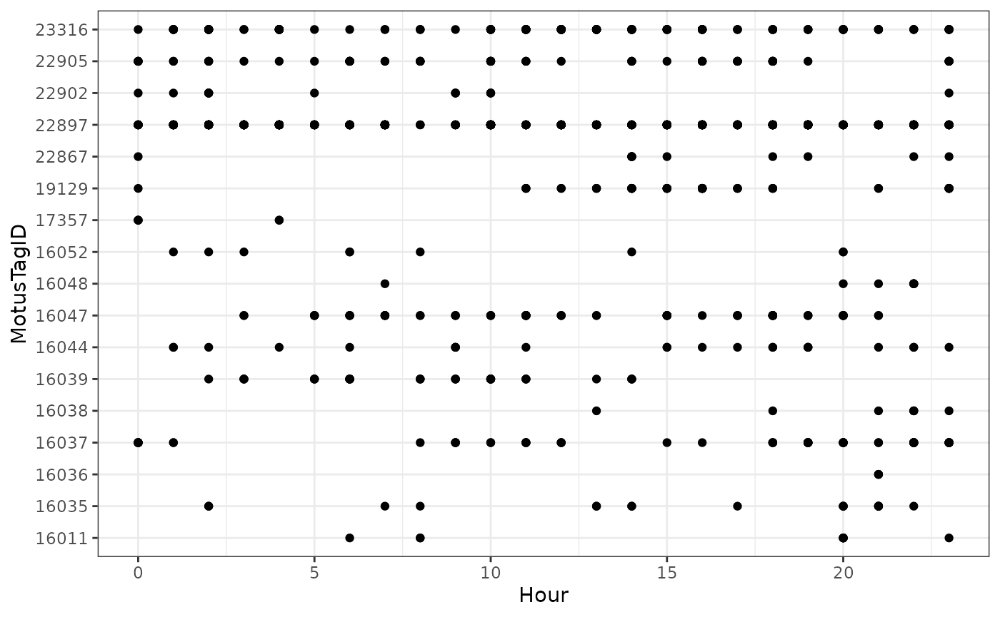
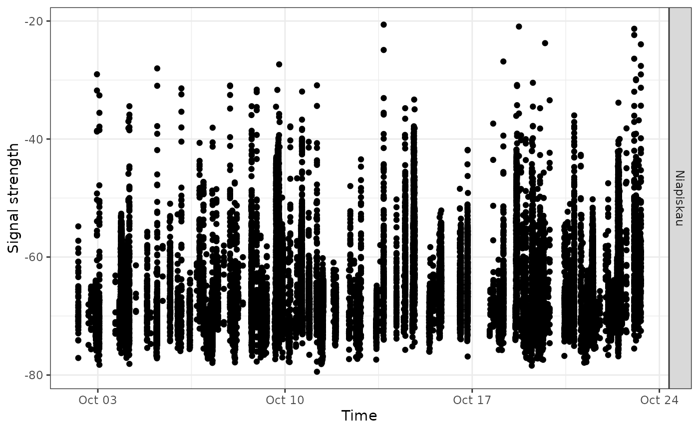
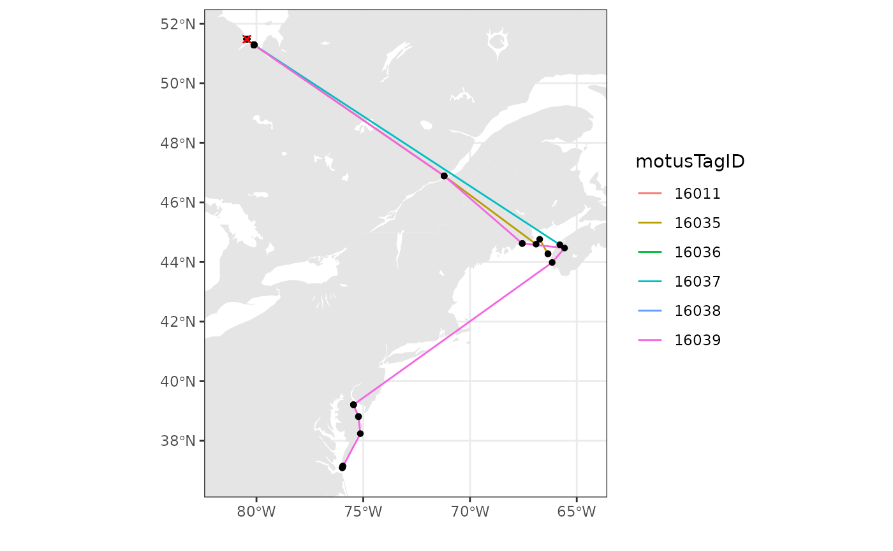
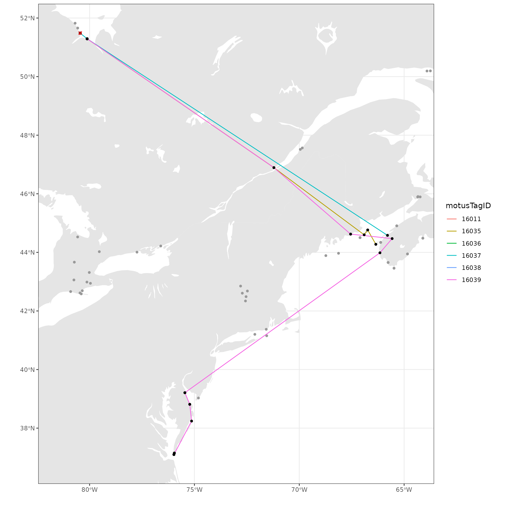

# Chapter 6 - Exploring detections data

> In this chapter, we’ll finally start exploring our data by
> summarizing, plotting and mapping.

Once you have clarified any possible ambiguous tags and removed false
positives, you are ready to start analyzing your clean data set. This
chapter will walk you through some simple procedures to start working
with and visualizing the clean sample data set; you can modify these
scripts to work with your own data. For a more in-depth R tutorial we
strongly recommend working through [R for Data
Science](https://r4ds.hadley.nz/) by Garrett Grolemund and Hadley
Wickham.

## Load required packages

Follow the instructions in [Chapter
2](https://motuswts.github.io/motus/articles/02-installing-packages.md)
to install the following packages before loading, if you haven’t already
done so.

``` r
library(motus)
library(tidyverse)
library(sf)
library(lubridate)
library(rnaturalearth)

Sys.setenv(TZ = "UTC")
```

## Load data

If you followed along with the the previous Chapter ([Chapter 5 - Data
cleaning](https://motuswts.github.io/motus/articles/05-data-cleaning.md))
and are working with the cleaned `df_alltags_sub` file, you can skip
this step and go directly to [Summarizing your
data](#summarizing-your-data).

Otherwise, if you saved your data as an RDS file, you can load it using:

``` r
df_alltags_sub <- readRDS("./data/dfAlltagsSub.rds") # change dir to local directory
```

Or, if you’ve applied a custom filter to your `.motus` file, you can
load the previously downloaded sample Motus data (see [Chapter
3](https://motuswts.github.io/motus/articles/03-accessing-data.md)) and
clean it now. Currently the main benefit of using the custom filter is
that you apply the filter to the `.motus` file, which allows you more
flexibility in applying `dplyr` functions to manage and filter the data
(e.g., you can select different variables to include in the data than we
included in the RDS file in [Chapter 5 - Data
cleaning](https://motuswts.github.io/motus/articles/05-data-cleaning.md)).
This approach also allows you to more readily integrate new data added
to your database with the
[`tagme()`](https://motuswts.github.io/motus/reference/tagme.md)
function. Because we are selecting the same variables and filtering the
same records, the following gives you the same dataset as the
[`readRDS()`](https://rdrr.io/r/base/readRDS.html) statement above:

``` r
# load the .motus file (remember 'motus.sample' is both username and password)
sql_motus <- tagme(176, dir = "./data/")
```

    ## Checking for new data in project 176

    ## Updating metadata

    ## activity:     1 new batch records to check

    ## batchID  1977125 (#     1 of      1): got    156 activity records

    ## Downloaded 156 activity records

    ## nodeData:     0 new batch records to check

    ## Fetching deprecated batches

    ## Total deprecated batches: 6
    ## New deprecated batches: 0

``` r
tbl_alltags <- tbl(sql_motus, "alltags")

# obtain a table object of the filter
tbl_filter <- getRunsFilters(sql_motus, "filtAmbigFalsePos")

# filter and convert the table into a dataframe, with a few modications
df_alltags_sub <- left_join(tbl_alltags, tbl_filter, by = c("runID", "motusTagID")) %>%
  mutate(probability = ifelse(is.na(probability), 1, probability)) %>%
  filter(probability > 0) %>%
  collect()

# Now Let's clarify the dates and names for use in the following examples
df_alltags_sub <- df_alltags_sub %>%
  mutate(time = as_datetime(ts),  # work with times AFTER transforming to flat file
         tagDeployStart = as_datetime(tagDeployStart),
         tagDeployEnd = as_datetime(tagDeployEnd),
         recvDeployName = if_else(is.na(recvDeployName), 
                                  paste(recvDeployLat, recvDeployLon, sep=":"), 
                                  recvDeployName))
```

**Note that if your project is very large, you may want to convert only
a portion of it to the dataframe, to avoid memory issues.**

Details on filtering the `tbl` prior to collecting as a dataframe are
available in [Converting to flat data in Chapter
3](https://motuswts.github.io/motus/articles/03-accessing-data.html#converting-to-flat-data).

Here we do so by adding a filter to the above command, in this case,
only creating a dataframe for `motusTagID` 16047, but you can decide how
to best subset your data based on your need (e.g. by species or year):

``` r
# create a subset for a single tag, to keep the dataframe small
df_alltags_16047 <- filter(df_alltags_sub, motusTagID == 16047) 
```

## Summarizing your data

Here we will run through some basic commands, starting with the
[`summary()`](https://rdrr.io/r/base/summary.html) function to view a
selection of variables in a data frame:

``` r
sql_motus %>% 
  tbl("alltags") %>% 
  select(ts, motusTagID, runLen, speciesEN, tagDepLat, tagDepLon, 
         recvDeployLat, recvDeployLon) %>% 
  collect() %>%
  mutate(time = as_datetime(ts)) %>% 
  summary()
```

    ##        ts              motusTagID        runLen        speciesEN        
    ##  Min.   :1.438e+09   Min.   :10811   Min.   :   2.0   Length:109474     
    ##  1st Qu.:1.476e+09   1st Qu.:22897   1st Qu.:  30.0   Class :character  
    ##  Median :1.477e+09   Median :22905   Median : 120.0   Mode  :character  
    ##  Mean   :1.476e+09   Mean   :22639   Mean   : 353.8                     
    ##  3rd Qu.:1.477e+09   3rd Qu.:23316   3rd Qu.: 402.0                     
    ##  Max.   :1.498e+09   Max.   :24303   Max.   :2474.0                     
    ##                                                                         
    ##    tagDepLat       tagDepLon      recvDeployLat    recvDeployLon    
    ##  Min.   :11.12   Min.   :-80.69   Min.   :-42.50   Min.   :-143.68  
    ##  1st Qu.:50.19   1st Qu.:-63.75   1st Qu.: 50.20   1st Qu.: -63.75  
    ##  Median :50.19   Median :-63.75   Median : 50.20   Median : -63.75  
    ##  Mean   :50.15   Mean   :-65.86   Mean   : 48.50   Mean   : -65.68  
    ##  3rd Qu.:50.19   3rd Qu.:-63.75   3rd Qu.: 50.20   3rd Qu.: -63.75  
    ##  Max.   :51.80   Max.   :-63.75   Max.   : 62.89   Max.   : -60.02  
    ##  NA's   :2069    NA's   :2069     NA's   :173      NA's   :173      
    ##       time                    
    ##  Min.   :2015-07-23 10:10:54  
    ##  1st Qu.:2016-10-10 21:26:15  
    ##  Median :2016-10-19 15:29:45  
    ##  Mean   :2016-10-12 05:31:23  
    ##  3rd Qu.:2016-10-22 06:44:40  
    ##  Max.   :2017-06-26 16:11:04  
    ## 

``` r
# same summary for the filtered sql data
df_alltags_sub %>% 
  select(time, motusTagID, runLen, speciesEN, tagDepLat, tagDepLon, 
         recvDeployLat, recvDeployLon) %>% 
  summary()
```

    ##       time                       motusTagID        runLen      
    ##  Min.   :2015-08-03 06:37:11   Min.   :16011   Min.   :   4.0  
    ##  1st Qu.:2016-10-06 19:17:36   1st Qu.:22897   1st Qu.:  27.0  
    ##  Median :2016-10-09 21:48:11   Median :22897   Median :  97.0  
    ##  Mean   :2016-09-05 10:37:42   Mean   :22267   Mean   : 235.1  
    ##  3rd Qu.:2016-10-19 10:37:42   3rd Qu.:22897   3rd Qu.: 287.0  
    ##  Max.   :2017-04-20 22:33:19   Max.   :23316   Max.   :1371.0  
    ##                                                                
    ##   speciesEN           tagDepLat       tagDepLon      recvDeployLat  
    ##  Length:48133       Min.   :50.19   Min.   :-80.69   Min.   :37.10  
    ##  Class :character   1st Qu.:50.19   1st Qu.:-63.75   1st Qu.:50.20  
    ##  Mode  :character   Median :50.19   Median :-63.75   Median :50.20  
    ##                     Mean   :50.34   Mean   :-65.56   Mean   :50.05  
    ##                     3rd Qu.:50.19   3rd Qu.:-63.75   3rd Qu.:50.20  
    ##                     Max.   :51.80   Max.   :-63.75   Max.   :51.82  
    ##                                                      NA's   :164    
    ##  recvDeployLon   
    ##  Min.   :-80.69  
    ##  1st Qu.:-63.75  
    ##  Median :-63.75  
    ##  Mean   :-65.26  
    ##  3rd Qu.:-63.75  
    ##  Max.   :-62.99  
    ##  NA's   :164

The `dplyr` package allows you to easily summarize data by group,
manipulate variables, or create new variables based on your data.

We can manipulate existing variables or create new ones with `dplyr`’s
[`mutate()`](https://dplyr.tidyverse.org/reference/mutate.html)
function, here we’ll convert `ts` to a date/time format, then make a new
variable for year and day of year (`doy`).

We’ll also remove the set of points with missing receiver latitude and
longitudes. These may be useful in some contexts (for example if the
approximate location of the receiver is known) but can cause warnings or
errors when plotting.

``` r
df_alltags_sub <- df_alltags_sub %>%
  mutate(year = year(time), # extract year from time
         doy = yday(time)) %>% # extract numeric day of year from time
  filter(!is.na(recvDeployLat))

head(df_alltags_sub)
```

    ## # A tibble: 6 × 67
    ##    hitID runID batchID       ts tsCorrected   sig sigsd noise  freq freqsd  slop
    ##    <int> <int>   <int>    <dbl>       <dbl> <dbl> <dbl> <dbl> <dbl>  <dbl> <dbl>
    ## 1  45107  8886      53   1.45e9 1445858390.    52     0   -96     4      0  1e-4
    ## 2  45108  8886      53   1.45e9 1445858429.    54     0   -96     4      0  1e-4
    ## 3  45109  8886      53   1.45e9 1445858477.    55     0   -96     4      0  1e-4
    ## 4  45110  8886      53   1.45e9 1445858516.    52     0   -96     4      0  1e-4
    ## 5  45111  8886      53   1.45e9 1445858564.    49     0   -96     4      0  1e-4
    ## 6 199885 23305      64   1.45e9 1445857924.    33     0   -96     4      0  1e-4
    ## # ℹ 56 more variables: burstSlop <dbl>, done <int>, motusTagID <int>,
    ## #   ambigID <int>, port <chr>, nodeNum <chr>, runLen <int>, motusFilter <dbl>,
    ## #   bootnum <int>, tagProjID <int>, mfgID <chr>, tagType <chr>, codeSet <chr>,
    ## #   mfg <chr>, tagModel <chr>, tagLifespan <int>, nomFreq <dbl>, tagBI <dbl>,
    ## #   pulseLen <dbl>, tagDeployID <int>, speciesID <int>, markerNumber <chr>,
    ## #   markerType <chr>, tagDeployStart <dttm>, tagDeployEnd <dttm>,
    ## #   tagDepLat <dbl>, tagDepLon <dbl>, tagDepAlt <dbl>, tagDepComments <chr>, …

We can also summarize information by group, in this case `motusTagID`,
and apply various functions to these groups such as getting the total
number of detections (`n`) for each tag, the number of receivers each
tag was detected on, the first and last detection date, and the total
number of days there was at least one detection:

``` r
tagSummary <- df_alltags_sub %>%
  group_by(motusTagID) %>% 
  summarize(nDet = n(),
            nRecv = length(unique(recvDeployName)),
            timeMin = min(time),
            timeMax = max(time),
            totDay = length(unique(doy)))

head(tagSummary)
```

    ## # A tibble: 6 × 6
    ##   motusTagID  nDet nRecv timeMin             timeMax             totDay
    ##        <int> <int> <int> <dttm>              <dttm>               <int>
    ## 1      16011   116     1 2015-08-03 06:37:11 2015-08-05 20:41:12      3
    ## 2      16035   415     5 2015-08-14 17:53:49 2015-09-02 14:06:09      6
    ## 3      16036    62     1 2015-08-17 21:56:44 2015-08-17 21:58:52      1
    ## 4      16037  1278     3 2015-08-23 15:13:57 2015-09-08 18:37:16     14
    ## 5      16038    70     1 2015-08-20 18:42:33 2015-08-22 22:19:37      3
    ## 6      16039  1044    10 2015-08-23 02:28:45 2015-09-19 06:08:31      8

We can also group by multiple variables; applying the same function as
above but now grouping by `motusTagID` and `recvDeployName`, we will get
information for each tag detected on each receiver. Since we are
grouping by `recvDeployName`, there will be by default only one
`recvDeployName` in each group, thus the variable `nRecv` will be 1 for
each row. This in not very informative, however we include this to help
illustrate how grouping works:

``` r
tagRecvSummary <- df_alltags_sub %>%
  group_by(motusTagID, recvDeployName) %>% 
  summarize(nDet = n(),
            nRecv = length(unique(recvDeployName)),
            timeMin = min(time),
            timeMax = max(time),
            totDay = length(unique(doy)), .groups = "drop")

head(tagRecvSummary)
```

    ## # A tibble: 6 × 7
    ##   motusTagID recvDeployName  nDet nRecv timeMin             timeMax            
    ##        <int> <chr>          <int> <int> <dttm>              <dttm>             
    ## 1      16011 North Bluff      116     1 2015-08-03 06:37:11 2015-08-05 20:41:12
    ## 2      16035 Brier2            38     1 2015-09-02 14:03:19 2015-09-02 14:06:09
    ## 3      16035 D'Estimauville    32     1 2015-09-02 07:58:43 2015-09-02 08:04:24
    ## 4      16035 Netitishi        274     1 2015-08-14 17:53:49 2015-09-01 21:35:32
    ## 5      16035 Southwest Head    65     1 2015-09-02 13:06:13 2015-09-02 13:14:39
    ## 6      16035 Swallowtail        6     1 2015-09-02 13:21:27 2015-09-02 13:22:22
    ## # ℹ 1 more variable: totDay <int>

## Plotting your data

Plotting your data is a powerful way to visualize broad and fine-scale
detection patterns. This section will give you a brief introduction to
plotting using `ggplot2`. For more in depth information on the uses of
`ggplot2`, we recommend the [Cookbook for
R](http://www.cookbook-r.com/Graphs/), and the RStudio [`ggplot2`
cheatsheet](https://www.rstudio.com/wp-content/uploads/2015/03/ggplot2-cheatsheet.pdf).

To make coarse-scale plots with large files, we suggest first rounding
the detection time to the nearest hour or day so that processing time is
faster. Here we round detection times to the nearest hour, then make a
basic plot of hourly detections by `motusTagID`:

``` r
df_alltags_sub_2 <- df_alltags_sub %>%
  mutate(hour = hour(time)) %>% 
  select(motusTagID, port, tagDeployStart, tagDepLat, tagDepLon, 
         recvDeployLat, recvDeployLon, recvDeployName, antBearing, speciesEN, year, doy, hour) %>% 
  distinct()

ggplot(data = df_alltags_sub_2, aes(x = hour, y = as.factor(motusTagID))) +
  theme_bw() +
  geom_point() + 
  labs(x = "Hour", y = "MotusTagID")
```



Let’s focus only on tags deployed in 2016, and we can colour the tags by
species:

``` r
ggplot(data = filter(df_alltags_sub_2, year(tagDeployStart) == 2016), 
       aes(x = hour, y = as.factor(motusTagID), colour = speciesEN)) +
  theme_bw() + 
  geom_point() +
  labs(x = "Hour", y = "MotusTagID") +
  scale_colour_discrete(name = "Species")
```


We can see how tags moved latitudinally by first ordering by hour, and
colouring by `motusTagID`:

``` r
df_alltags_sub_2 <- arrange(df_alltags_sub_2, hour)

ggplot(data = filter(df_alltags_sub_2, year(tagDeployStart) == 2016), 
       aes(x = hour, y = recvDeployLat, col = as.factor(motusTagID), 
           group = as.factor(motusTagID))) + 
  theme_bw() + 
  geom_point() +
  geom_path() +
  labs(x = "Hour", y = "Receiver latitude") +
  scale_colour_discrete(name = "MotusTagID")
```


Now let’s look at more detailed plots of signal variation. We use the
full `df_alltags_sub` dataframe so that we can get signal strength for
each detection of a specific tag. Let’s examine fall 2016 detections of
tag 22897 at Niapiskau; we facet the plot by deployment name, ordered by
decreasing latitude:

``` r
ggplot(data = filter(df_alltags_sub, 
                     motusTagID == 22897, 
                     recvDeployName == "Niapiskau"), 
       aes(x = time, y = sig)) +
  theme_bw() + 
  geom_point() + 
  labs(x = "Time", y = "Signal strength") +
  facet_grid(recvDeployName ~ .)
```



We use the
[`sunRiseSet()`](https://motuswts.github.io/motus/reference/sunRiseSet.md)
to get sunrise and sunset times for all detections. We then zoom in on a
certain timeframe and add that information to the above plot by adding a
[`geom_vline()`](https://ggplot2.tidyverse.org/reference/geom_abline.html)
statement to the code, which adds a yellow line for sunrise time, and a
blue line for sunset time:

``` r
# add sunrise and sunset times to the dataframe
df_alltags_sub <- sunRiseSet(df_alltags_sub, lat = "recvDeployLat", lon = "recvDeployLon") 

ggplot(data = filter(df_alltags_sub, motusTagID == 22897,
                     time > "2016-10-11",
                     time < "2016-10-17",
                     recvDeployName == "Niapiskau"), 
       aes(x = time, y = sig)) +
  theme_bw() + 
  geom_point() + 
  labs(x = "Time of year", y = "Signal strength") +
  geom_vline(aes(xintercept = sunrise), col = "orange") + 
  geom_vline(aes(xintercept = sunset), col = "blue")
```


We can see that during this period, the tag was most often detected
during the day, suggesting it may be actively foraging in this area
during this time.

The same plots can provide valuable movement information when the
receivers are ordered geographically. We do this for `motusTagID` 16039:

``` r
# We'll first order sitelat by latitude (for plots)
df_alltags_sub <- mutate(df_alltags_sub, 
                         recvDeployName = reorder(recvDeployName, recvDeployLat))

ggplot(data = filter(df_alltags_sub, 
                     motusTagID == 16039,
                     time < "2015-10-01"), 
       aes(x = time, y = recvDeployName)) +
  theme_bw() + 
  geom_point() + 
  labs(x = "Time of year", y = "Receiver name (ordered by latitude)")
```


We zoom in on a section of this plot and look at antenna bearings to see
directional movement past stations:

``` r
ggplot(data = filter(df_alltags_sub, motusTagID == 16039, 
                     time > "2015-09-14", 
                     time < "2015-10-01"), 
       aes(x = time, y = sig, col = as.factor(antBearing))) +
  theme_bw() + 
  geom_point() + 
  labs(x = "Time of day", y = "Signal strength") +
  scale_color_discrete(name = "Antenna bearing") +
  facet_grid(recvDeployName ~ .)
```


This plot shows the typical fly-by pattern of a migrating animal, with
signal strength increasing and then decreasing as the tag moves through
the beams of the antennas.

## Mapping your data

To generate maps of tag paths, we will once again use summarized data so
we can work with a much smaller database for faster processing. Here
we’ll summarize detections by day. We will use code similar to the code
we used in [Chapter 5 - Data
cleaning](https://motuswts.github.io/motus/articles/05-data-cleaning.md),
however, here we will create a simple function to summarize the data,
since we will likely want to do this type of summary over and over
again.

``` r
# Simplify the data by summarizing by the runID
# If you want to summarize at a finer (or coarser) scale, you can also create
# other groups.

fun.getpath <- function(df) {
  df %>%
    filter(tagProjID == 176, # keep only tags registered to the sample project
           !is.na(recvDeployLat) | !(recvDeployLat == 0)) %>% 
    group_by(motusTagID, runID, recvDeployName, ambigID, 
             tagDepLon, tagDepLat, recvDeployLat, recvDeployLon) %>%
    summarize(max.runLen = max(runLen), time = mean(time), .groups = "drop") %>%
    arrange(motusTagID, time) %>%
    data.frame()
} # end of function call

df_alltags_path <- fun.getpath(df_alltags_sub)
```

``` r
df_alltags_sub_path <- df_alltags_sub %>%
  filter(tagProjID == 176) %>% # only tags registered to project
  arrange(motusTagID, time) %>%       # order by time stamp for each tag
  mutate(date = as_date(time)) %>%    # create date variable
  group_by(motusTagID, date, recvDeployName, ambigID, 
           tagDepLon, tagDepLat, recvDeployLat, recvDeployLon)

df_alltags_path <- fun.getpath(df_alltags_sub_path)
```

### Creating simple maps with the `sf` package

Mapping allows us to spatially view our data and connect sequential
detections that may represent flight paths in some cases. First we load
base maps from the `rnaturalearth` package. Please see [Chapter
4](https://motuswts.github.io/motus/articles/04-deployments.html#location-of-tag-deployments)
for more detail if you have not already downloaded the `rnaturalearth`
shapefiles.

``` r
world <- ne_countries(scale = "medium", returnclass = "sf") 
lakes <- ne_load(type = "lakes", scale = "medium", category = 'physical',
                 returnclass = "sf",
                 destdir = "map-data") # use this if already downloaded shapefiles
```

Then, to map the paths, we set the x-axis and y-axis limits based on the
location of receivers with detections. Depending on your data, these
might need to be modified to encompass the deployment location of the
tags, if tags were not deployed near towers with detections. We then use
`ggplot` and `sf` to plot the map and tag paths. We add points for
receivers and lines connecting consecutive detections by `motusTagID`.
We also include an ‘x’ for where tags were deployed.

``` r
# just use the tags that we have examined carefully and filtered (in the
# previous chapter)
df_tmp <- df_alltags_path %>%
  filter(motusTagID %in% c(16011, 16035, 16036, 16037, 16038, 16039)) %>%
  arrange(time)  %>% # arrange by hour
  as.data.frame()

# set limits to map based on locations of detections, ensuring they include the
# deployment locations
xmin <- min(df_tmp$recvDeployLon, na.rm = TRUE) - 2
xmax <- max(df_tmp$recvDeployLon, na.rm = TRUE) + 2
ymin <- min(df_tmp$recvDeployLat, na.rm = TRUE) - 1
ymax <- max(df_tmp$recvDeployLat, na.rm = TRUE) + 1

# map
ggplot(data = world) + 
  geom_sf(colour = NA) +
  geom_sf(data = lakes, colour = NA, fill = "white") +
  coord_sf(xlim = c(xmin, xmax), ylim = c(ymin, ymax), expand = FALSE) +
  theme_bw() + 
  labs(x = "", y = "") +
  geom_path(data = df_tmp, 
            aes(x = recvDeployLon, y = recvDeployLat, 
                group = as.factor(motusTagID), colour = as.factor(motusTagID))) +
  geom_point(data = df_tmp, aes(x = recvDeployLon, y = recvDeployLat), 
             shape = 16, colour = "black") +
  geom_point(data = df_tmp, 
             aes(x = tagDepLon, y = tagDepLat), colour = "red", shape = 4) +
  scale_colour_discrete("motusTagID") 
```

 We can
also add points for all receivers that were active, but did not detect
these birds during a certain time period if we have already downloaded
all metadata.

``` r
# get receiver metadata
tbl_recvDeps <- tbl(sql_motus, "recvDeps")
df_recvDeps <- tbl_recvDeps %>% 
  collect() %>% 
  mutate(timeStart = as_datetime(tsStart),
         timeEnd = as_datetime(tsEnd),
         # for deployments with no end dates, make an end date a year from now
         timeEnd = if_else(is.na(timeEnd), Sys.time() + years(1), timeEnd))

# get running intervals for all receiver deployments
siteOp <- with(df_recvDeps, interval(timeStart, timeEnd))

# set the date range you're interested in
dateRange <- interval(as_date("2015-08-01"), as_date("2016-01-01"))

# create new variable "active" which will be set to TRUE if the receiver was
# active at some point during your specified date range, and FALSE if not
df_recvDeps$active <- int_overlaps(siteOp, dateRange) 

# create map with receivers active during specified date range as red, and
# receivers with detections as yellow
ggplot(data = world) + 
  geom_sf(colour = NA) +
  geom_sf(data = lakes, colour = NA, fill = "white") +
  coord_sf(xlim = c(xmin, xmax), ylim = c(ymin, ymax), expand = FALSE) +
  theme_bw() + 
  labs(x = "", y = "") +
  geom_point(data = filter(df_recvDeps, active == TRUE), 
             aes(x = longitude, y = latitude), 
             shape = 16, colour = "grey60") +
  geom_path(data = df_tmp, 
            aes(x = recvDeployLon, y = recvDeployLat, 
                group = as.factor(motusTagID), colour = as.factor(motusTagID))) +
  geom_point(data = df_tmp, aes(x = recvDeployLon, y = recvDeployLat), 
             shape = 16, colour = "black") +
  geom_point(data = df_tmp, 
             aes(x = tagDepLon, y = tagDepLat), colour = "red", shape = 4) +
  scale_colour_discrete("motusTagID") 
```



### Mapping with the `ggspatial` package

Mapping with `ggspatial` allows you to select from multiple base layers.

The first step is to convert the data to spatial data sets. Then we can
plot this data using ggplot2 and the
[`geom_sf()`](https://ggplot2.tidyverse.org/reference/ggsf.html)
function as above. We add the base map with the ggspatial function,
[`annotation_map_tile()`](https://paleolimbot.github.io/ggspatial/reference/annotation_map_tile.html).
You can change the basemap tiles by using `type = "stamenwatercolor`, (
or “osm”, “stamenbw”, among others).

We then add points for receivers and lines connecting consecutive
detections by `motusTagID.`

Remember that base maps generally require attribution in publications.

``` r
library(ggspatial)

# just use the tags that we have examined carefully and filtered (in the
# previous chapter)
df_tmp <- df_alltags_path %>%
  filter(motusTagID %in% c(16011, 16035, 16036, 16037, 16038, 16039)) %>%
  arrange(time)  %>% # arrange by hour
  as.data.frame()

# Convert to spatial
df_paths <- points2Path(df_tmp, by = "motusTagID")
df_points <- st_as_sf(df_tmp, coords = c("recvDeployLon", "recvDeployLat"),
                      crs = 4326)

# Plot 
ggplot() +
  theme_bw() +
  annotation_map_tile() +
  geom_sf(data = df_paths, aes(colour = as.factor(motusTagID)), linewidth = 1) +
  geom_sf(data = df_points, shape = 21, colour = "black", fill = "yellow", size = 2) +
  scale_color_viridis_d(name = "MotusTagID", end = 0.8) +
  labs(caption = "Map data from OpenStreetMap")
```

    ##   |                                                                              |                                                                      |   0%  |                                                                              |==================                                                    |  25%  |                                                                              |===================================                                   |  50%  |                                                                              |====================================================                  |  75%  |                                                                              |======================================================================| 100%


See also the
[`plotRouteMap()`](https://motuswts.github.io/motus/reference/plotRouteMap.md)
for a shortcut function which will produce a similar plot of your entire
data base (optionally limited by date).

### Mapping with the `ggmap` package

> We no longer recommend using the `ggmap` package unless you want to
> use Google Maps and have your own API key.

Mapping with `ggmap` allows you to select from multiple base layers.  
There are several ways to use the `ggmap` package. One is with Google
Maps, which, as of October 16, 2018, requires a Google Maps API key (see
[Troubleshooting](https://motuswts.github.io/motus/articles/troubleshooting.html#google-maps)
for more details).

See the `ggmap` [README](https://github.com/dkahle/ggmap#google-maps)
for more details.

The functions above provide examples of how you can begin exploring your
data and are by no means exhaustive.

> **What Next?** [Explore all
> articles](https://motuswts.github.io/motus/articles/index.md)
