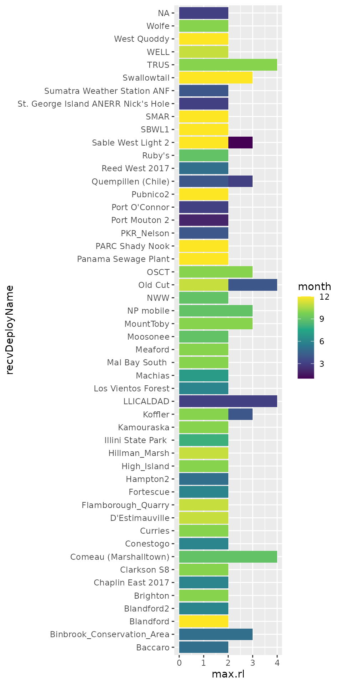

# In-depth detections filtering

Invariably you will run into some false detections in your tag detection
data. Sometimes these may be due to random glitches or noisy radio
conditions. The various outputs on the Motus web site are pre-filtered,
but the `motus` R package provides access to **all** detection data,
allowing users more control over which detections to keep or omit.

Therefore, it is important to filter out invalid or questionable
detections as part of your data cleaning process. [Chapter 5 - Data
cleaning](https://motuswts.github.io/motus/articles/05-data-cleaning.md)
is a good place to start for a walk-through of the basic filtering
process. In this article we’ll cover two methods of filtering out
dubious hits based on radio noise (activity) and run lengths in more
detail.

## Background

``` r
library(motus)
library(tidyverse)
library(lubridate)

sql_motus <- tagme(176, dir = "./data/")
```

As runs are composed of sequences of hits, the longer the run the more
confident we can be that it represents a true detection.

Run lengths (`runLen`) are included in the `alltags` view.

``` r
tbl(sql_motus, "alltags") %>%
  select(hitID, runID, batchID, motusTagID, runLen)
```

    ## # Source:   SQL [?? x 5]
    ## # Database: sqlite 3.51.1 [/home/runner/work/motus/motus/vignettes/articles/data/project-176.motus]
    ##     hitID runID batchID motusTagID runLen
    ##     <int> <int>   <int>      <int>  <int>
    ##  1  45107  8886      53      16047      5
    ##  2  45108  8886      53      16047      5
    ##  3  45109  8886      53      16047      5
    ##  4  45110  8886      53      16047      5
    ##  5  45111  8886      53      16047      5
    ##  6 199885 23305      64      16047     11
    ##  7 199886 23305      64      16047     11
    ##  8 199887 23305      64      16047     11
    ##  9 199888 23305      64      16047     11
    ## 10 199889 23305      64      16047     11
    ## # ℹ more rows

However, local conditions at an individual receiver may vary in their
level of background radio noise/interference. Sites with more background
noise may be more prone to generating a high number of very short runs
that are actually spurious data.

The `activity` table contains information on the number of runs
(`numRuns`) and how many of these runs were particularly short (i.e. 2
hits = `run2` or 3 hits = `run3`, etc.) per hour (`hourBin`).

``` r
tbl(sql_motus, "activity") %>%
  select(batchID, motusDeviceID, ant, hourBin, numRuns, run2, run3)
```

    ## # Source:   SQL [?? x 7]
    ## # Database: sqlite 3.51.1 [/home/runner/work/motus/motus/vignettes/articles/data/project-176.motus]
    ##    batchID motusDeviceID ant   hourBin numRuns  run2  run3
    ##      <int>         <int> <chr>   <int>   <int> <int> <int>
    ##  1      53           486 1      400872       1     0     0
    ##  2      53           486 1      401014       1     0     0
    ##  3      53           486 1      401204       1     0     0
    ##  4      53           486 -1     401014       1     1     0
    ##  5      53           486 -1     401204       1     0     0
    ##  6      53           486 2      401012       1     0     1
    ##  7      53           486 2      401014       1     1     0
    ##  8      53           486 2      401204       1     0     0
    ##  9      53           486 3      400796       1     1     0
    ## 10      53           486 3      400872       1     0     1
    ## # ℹ more rows

Therefore a good first pass filter should use both the length of a run
and the amount of radio activity (number of short runs) at a given site
to determine whether or not to remove a run of hits.

## Empirically-based cutoffs

Based on these ideas and through empirical examination of data, the
Motus team has determined a set of specific cutoffs that work well as a
default filter.

In general, short runs (with a length of only 2 or 3) have a relatively
high probability of being false positives. In contrast, long runs (with
a length of 5 or more) have a high probability of being true positives.
Therefore, runs with a length of 3 or less are conservatively considered
invalid, and runs with a length of 5 or more are considered valid.

At noisy sites, there is a greater chance of having spurious detections.
Therefore, intermediate runs (with a length of 4), are considered valid
at quiet sites, but likely invalid at noisy sites. Noisy sites are
categorized as those with many runs (\>= 100 in an `hourBin`) and a high
ratio of runs with lengths of 2 at a given time (\>= 85% per `hourBin`).

## Filtering in `motus`

There are two filtering options in the `motus` R package that follow
these ideas:

1.  `motusFilter` is a field/column in the `runs` table is the easiest
    option [¹](#fn1)
2.  [`filterByActivity()`](https://motuswts.github.io/motus/reference/filterByActivity.md)
    is a function in the `motus` package and is more customizable

### `motusFilter`

The column/field `motusFilter` in the `runs` table is a filter value
created on the server that reflects:

1.  [Empirically-based cutoffs](#empirically-based-cutoffs) defined
    above
2.  Some manual filtering based on aliasing or out-of-range records
    [²](#fn2)

This is a good first option for identifying detections that have a
higher probability of being false. Currently the `motusFilter` contains
just two values `0` or `1`. Runs with a `motusFilter` of `0` are
considered invalid (i.e. have a low probability of being true
detections) and can therefore be omitted.

``` r
tbl(sql_motus, "runs")
```

    ## # Source:   table<`runs`> [?? x 10]
    ## # Database: sqlite 3.51.1 [/home/runner/work/motus/motus/vignettes/articles/data/project-176.motus]
    ##     runID batchIDbegin     tsBegin  tsEnd  done motusTagID ant     len nodeNum motusFilter
    ##     <int>        <int>       <dbl>  <dbl> <int>      <int> <chr> <int> <chr>         <dbl>
    ##  1   8886           53 1445858390. 1.45e9     1      16047 3         5 NA                1
    ##  2  23305           64 1445857924. 1.45e9     1      16047 1        11 NA                1
    ##  3  23306           64 1445858341. 1.45e9     1      16047 3         6 NA                1
    ##  4  23307           64 1445858497. 1.45e9     1      16047 2         5 NA                1
    ##  5  23308           64 1445858826. 1.45e9     1      16047 2         5 NA                1
    ##  6 104118          141 1445858904. 1.45e9     1      16047 2         3 NA                0
    ##  7 104119          141 1445858875. 1.45e9     1      16047 3         3 NA                0
    ##  8 104120          141 1445858933. 1.45e9     1      16047 -1        2 NA                0
    ##  9 104131           97 1445855802. 1.45e9     1      16047 2         4 NA                1
    ## 10 104132           97 1445855812. 1.45e9     1      16047 3         5 NA                1
    ## # ℹ more rows

To omit runs identified as dubious by `motusFilter` we can use an
[`anti_join()`](https://dplyr.tidyverse.org/reference/filter-joins.html)
from the `dplyr` package.

First identify invalid runs with a `motusFilter` of `0`:

``` r
bad_runs <- tbl(sql_motus, "runs") %>%
  filter(motusFilter == 0)
```

Now use
[`anti_join()`](https://dplyr.tidyverse.org/reference/filter-joins.html)
to remove those runs from the `alltags` view:

``` r
alltags_filtered <- anti_join(tbl(sql_motus, "alltags"), bad_runs, by = "runID")
```

To double check we can filter for short runs in the original `alltags`
view

``` r
tbl(sql_motus, "alltags") %>%
  select(hitID, runID, batchID, motusTagID, runLen) %>%
  filter(runLen <= 3)
```

    ## # Source:   SQL [?? x 5]
    ## # Database: sqlite 3.51.1 [/home/runner/work/motus/motus/vignettes/articles/data/project-176.motus]
    ##     hitID  runID batchID motusTagID runLen
    ##     <int>  <int>   <int>      <int>  <int>
    ##  1 516095 104118     141      16047      3
    ##  2 516096 104118     141      16047      3
    ##  3 516097 104119     141      16047      3
    ##  4 516098 104119     141      16047      3
    ##  5 516099 104118     141      16047      3
    ##  6 516100 104119     141      16047      3
    ##  7 516101 104120     141      16047      2
    ##  8 516102 104120     141      16047      2
    ##  9 516132 104133      97      16047      2
    ## 10 516133 104133      97      16047      2
    ## # ℹ more rows

And compare this to our newly created `alltags_filtered` table

``` r
alltags_filtered %>%
  select(hitID, runID, batchID, motusTagID, runLen) %>%
  filter(runLen <= 3)
```

    ## # Source:   SQL [?? x 5]
    ## # Database: sqlite 3.51.1 [/home/runner/work/motus/motus/vignettes/articles/data/project-176.motus]
    ## # ℹ 5 variables: hitID <int>, runID <int>, batchID <int>, motusTagID <lgl>, runLen <int>

No more short runs, good!

### `filterByActivity()`

The `motusFilter` is one method of determining false detections, but
Motus users are encouraged to explore alternative filter parameters.

By default,
[`filterByActivity()`](https://motuswts.github.io/motus/reference/filterByActivity.md)
filters detections using the specific cutoffs defined above in
[Empirically-based cutoffs](#empirically-based-cutoffs). However, users
can fine-tune the filter by adjusting these cutoffs.

To get the same results as our above example with `motusFilter`, we can
use
[`filterByActivity()`](https://motuswts.github.io/motus/reference/filterByActivity.md)
with the default arguments and only return `good` (`runLen` \> 3) runs.

``` r
alltags_filtered2 <- filterByActivity(sql_motus, return = "good")
```

**Note** that
[`filterByActivity()`](https://motuswts.github.io/motus/reference/filterByActivity.md)
requires the SQLite database connection (not a flat data frame).

If we compare hits, runs, and batches, we see that the two filtered data
sets are identical (although this won’t always be the case[³](#fn3)).

``` r
test1 <- alltags_filtered %>%
  select(hitID, runID, batchID) %>%
  collect()

test2 <- alltags_filtered2 %>%
  select(hitID, runID, batchID) %>%
  collect()

waldo::compare(test1, test2)
```

    ## ✔ No differences

Alternatively we can change the default view used, so the
[`filterByActivity()`](https://motuswts.github.io/motus/reference/filterByActivity.md)
function uses the `alltagsGPS` view. **However**, on very large
databases this could be slow.

``` r
alltags_filtered3 <- filterByActivity(sql_motus, return = "all", view = "alltagsGPS")
```

#### Customizing the `filterByActivity()`

The
[`filterByActivity()`](https://motuswts.github.io/motus/reference/filterByActivity.md)
function uses the `activity` table to identify potentially problematic
runs. As above, you can return just the “true” positives
(`return = "good"`), but you can also return just the “false” positives
(`return = "bad"`) or all runs (`return = "all"`). If you return `all`
runs, you will also get a new column, `probability`, which reflects
either 0 (expected false positive) or 1 (expected true positive),
similar to the [`motusFilter` column](#motusfilter).

For example, the following code adds a `probability` column to the
sample project data.

``` r
alltags_filtered4 <- filterByActivity(sql_motus, return = "all") %>%
  select(hitID, runID, batchID, motusTagID, runLen, probability)

alltags_filtered4
```

    ## # A tibble: 108,999 × 6
    ##       hitID   runID batchID motusTagID runLen probability
    ##     <int64>   <int>   <int>      <int>  <int>       <dbl>
    ##  1 57633911 3923241   27722      16052      2           0
    ##  2 57633913 3923242   27722      16052      2           0
    ##  3 57633915 3923243   27722      16052      2           0
    ##  4 57633917 3923244   27722      16052      2           0
    ##  5 57633919 3923245   27722      16052      2           0
    ##  6 57633912 3923241   27722      16052      2           0
    ##  7 57633914 3923242   27722      16052      2           0
    ##  8 57633916 3923243   27722      16052      2           0
    ##  9 57633918 3923244   27722      16052      2           0
    ## 10 57633920 3923245   27722      16052      2           0
    ## # ℹ 108,989 more rows

You can adjust these parameters to be **less strict** (i.e., exclude
fewer detections). For example, here we exclude all runs of length 2 or
less (`minLen`), keep all runs of length 4 or more (`maxLen`), and will
exclude any runs less than length 3 (2 \< run \< 4) from an hour which
had more than 500 runs (`maxRuns`) and where at least 95% (`ratio`) of
those runs have a run length of 2.

``` r
relaxed <- filterByActivity(sql_motus, minLen = 2, maxLen = 4, 
                            maxRuns = 500, ratio = 0.95, 
                            return = "all")
```

These parameters can also be **more strict** (i.e., exclude more
detections). This next example excludes all runs of length 4 or less
(`minLen`), keeps all runs of length 10 or more (`maxLen`), and will
exclude any runs of length 5-9 (4 \< run \< 10) from hours which have
more than 50 runs (`maxRuns`) and where at least 75% (`ratio`) of those
runs have a run length of 2.

``` r
strict <- filterByActivity(sql_motus, minLen = 4, maxLen = 10, 
                           maxRuns = 50, ratio = 0.75, 
                           return = "all")
```

Note that the filters may exclude some true detections in the process.
Therefore, we recommend that after a full analysis of your data, you
return to these detections and examine them individually, to determine
(usually contextually) if they can be considered valid.

## Exploring problematic detections

You may also be interested more generally in exploring which data have
only short run lengths. For example, the following code shows the
maximum run length at all sites by month (for those runs which haven’t
been removed by filtering).

Here we will collect and summarize by receiver and month maximum run
lengths. We’ll create a date/time column `time` from the `ts` column
using
[`as_datetime()`](https://lubridate.tidyverse.org/reference/as_date.html)
from the lubridate package and we’ll use the
[`month()`](https://lubridate.tidyverse.org/reference/month.html)
function to pull out months.

``` r
max_runlen <- tbl(sql_motus, "alltags") %>%
  collect() %>%
  mutate(time = as_datetime(ts),
         month = month(time)) %>%
  group_by(recvDeployName, month) %>%
  summarize(max.rl = max(runLen))
```

    ## `summarise()` has grouped output by 'recvDeployName'. You can override using the
    ## `.groups` argument.

``` r
ggplot(max_runlen, aes(x = recvDeployName, y = max.rl, fill = month)) +
  geom_col(position = "dodge") +
  scale_fill_viridis_c() +
  coord_flip()
```


Alternatively, you can produce a list of sites where the maximum run
length of detections was never greater than (say) 4, which may sometimes
(but not always!) indicate they are simply false detections.

``` r
ggplot(filter(max_runlen, max.rl < 5), 
       aes(x = recvDeployName, y = max.rl, fill = month)) +
  geom_col(position = "dodge") +
  scale_fill_viridis_c() +
  coord_flip()
```



It is impossible to go through every possible issue that you may
encounter here. Users are strongly encouraged to explore their data
fully, and make reasoned decisions on which detections are unlikely or
indeterminate.

> **What Next?** [Explore all
> articles](https://motuswts.github.io/motus/articles/index.md)

------------------------------------------------------------------------

1.  If you are working with a dataset downloaded through
    [`tagme()`](https://motuswts.github.io/motus/reference/tagme.md)
    prior to July 2019 it will not include those values. In those cases,
    you will either need to download a new copy of the entire dataset
    for your project or receiver, or to use the
    [`filterByActivity()`](https://motuswts.github.io/motus/reference/filterByActivity.md)
    function described below to calculate the missing values.

2.  Future versions of the `motus` package should give users access to
    specific information on why each run was filtered (activity/noise or
    a manual assessment).

3.  Not *quite* the same because `motusFilter` does include some manual
    filtering.
