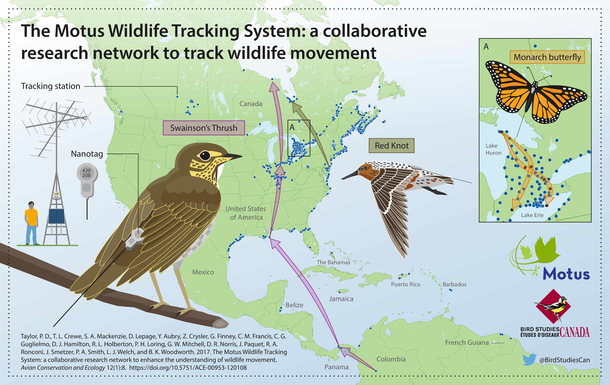

```{r fig1, echo=FALSE, fig.align='center'}

```


The Motus Wildlife Tracking System ([Motus](https://www.motus.org); [Taylor et al. 2017](#references)) is an international collaborative research network that uses coordinated, automated radio-telemetry to track the movement and behaviour of flying organisms affixed with digitally encoded radio-transmitters. 
Motus is a program of [Birds Canada](https://www.birdscanada.org) in partnership with collaborating researchers and organizations. 

Motus is unique in that all researchers in a geographic region (e.g., the Americas or Europe) use a shared radio frequency and coordinate detection data and metadata through the centralized Motus database. 
This allows tagged animals to be detected by receiving stations across the network, greatly broadening the spatial scope of potential research questions. 
Motus collaborators use a shared data infrastructure and web portal: all data collected from across the network are centrally stored and archived, which allows users to access detections of their tags by anyone's receiver in the network, and individuals that maintain receivers have access to all detections of anyone's tags on those receivers.

Having a shared data infrastructure also means that users can benefit from R functions written specifically for Motus data by any and all users. 
The `motus` R package is in continual development, and the intent of these articles is to help users learn the various functionalities of the package, and potentially contribute to it. 
The documentation also shows how additional R packages such as `ggplot2` can be used to explore, visualize, transform, and analyze Motus data. 

Therefore, the content of these articles will continue to evolve and grow along with the analytical needs of the network. 
Those interested in contributing code to the `motus` R package or examples/tutorials/articles to this website can contact <motus@birdscanada.org> or submit a pull request through [GitHub](https://github.com/MotusWTS/motus) regarding proposed additions.  

## What is not covered

These articles do not cover how to register projects, receivers, or tags with Motus, manage tag and station deployments, or upload raw detection data for processing.
Information to guide you through those tasks can be found under the [resources](https://motus.org/resources/) tab on the Motus website.  
It is critical that tag and station metadata is kept up-to-date. Otherwise data from these projects, tags, or receivers might not be processed. 
Please also review the [Motus collaboration policy, tag registration, and fee schedule](https://motus.org/policy/).

## Prerequisites

These articles assume that you have a basic understanding of R. 
Regardless of whether you are new to R or not, we highly recommend that you become familiar with [R for Data Science](https://r4ds.hadley.nz/) by Garrett Grolemund and Hadley Wickham. 
Their book covers how to import, visualize, and summarize data in R using the [tidyverse](https://www.tidyverse.org/) collection of R packages. 
It also provides an invaluable framework for [organizing your workflow](https://r4ds.hadley.nz/workflow-scripts#projects) to create clean, reproducible code. 
We follow their lead by, wherever possible, using the tidyverse framework throughout these articles.

## Sample datasets

Throughout these articles we use subsets of real datasets to illustrate how to access, manage, explore and analyze Motus data in R. 
We recommend that you run through the sample code in each chapter with the sample dataset **before** running through with your own data, because you will undoubtedly need to modify the code we provide in order to deal most effectively with your own data (every situation is different).

### James Bay Shorebird Project
Chapters 2 through 6 use a subset of data from the James Bay Shorebird Project. 
The James Bay Shorebird Project conducts monitoring and research on shorebirds staging along the James Bay coast, and is a collaborative effort among the Ontario Ministry of Natural Resources and Forestry, Birds Canada, Trent University, Moose Cree First Nation, and Environment and Climate Change Canada's Canadian Wildlife Service, in conjunction with a larger conservation initiative involving James Bay First Nations and Nature Canada. 
The Royal Ontario Museum was a contributing partner until 2016. 
The goals of the project are to 
1) improve the ability to estimate indices of abundance and population trends for shorebird species staging along the western James Bay coast, 
2) understand movement patterns and their causes, and 
3) identify the relative importance of shorebird staging sites and their habitats. Collectively, this information will aid in the development of conservation measures for Red Knot and other shorebird species, such as Western Hemisphere Shorebird Reserve Network (WHSRN) designation. 
More information can be viewed on the 
James Bay Shorebird Project [website](https://www.jamesbayshorebirdproject.com/), 
[Facebook page](https://www.facebook.com/jamesbayshorebirdproject/), 
or by contacting their project lead:

Christian Friis  
Wildlife Biologist / Biologiste de la Faune   
Canadian Wildlife Service Environment and Climate Change Canada / Government of Canada   
Service Canadien de la Faune Environnement et Changement Climatique Canada / Gouvernement du Canada  
<christian.friis@ec.gc.ca> / Tel: 416.739.4908

### Studies of Migratory Birds and Bats
In Chapter 7, we use a subset of data collected by the Motus project 'Studies of Migratory Birds and Bats, 2014-2017' (Projects #20 and #50) to illustrate the calculation of vanishing bearings of birds departing a stopover site. 
This project holds Motus data for several Western University projects that took place in southern Ontario, Canada. 
These projects were led by principal investigators (Chris Guglielmo and Yolanda Morbey) and a number of their graduate students. 
A variety of species of birds and bats were tracked. 
For more information contact:

Chris Guglielmo, Professor    
Department of Biology, Western University, Canada   
<cguglie2@uwo.ca> / Tel: 519.661.2111 (ext. 81204)

Yolanda Morbey, Associate Professor  
Department of Biology, Western University, Canada  
<ymorbey@uwo.ca> / Tel: 519.661.2111 (ext. 80116)

## Acknowledgements

These articles are largely based on the original Motus R Book by [Crewe et al. 2018](https://raw.githubusercontent.com/MotusWTS/motus/main/inst/extdata/MotusRBook2018-01.pdf), and have been supplemented by numerous Motus collaborators and Birds Canada Motus staff.

Motus is an international collaborative research network that uses coordinated automated radio telemetry to facilitate research and education on the ecology and conservation of small organisms. Motus is a program of Birds Canada in partnership with collaborating researchers and organizations. The Motus website includes a list of [Motus partners and collaborators](https://motus.org/data/partners). If your organization is not listed, please contact <motus@birdscanada.org>.

## References

Taylor, P. D., T. L. Crewe, S. A. Mackenzie, D. Lepage, Y. Aubry, Z. Crysler, G. Finney, C. M. Francis, C. G. Guglielmo, D. J. Hamilton, R. L. Holberton, P. H. Loring, G. W. Mitchell, D. R. Norris, J. Paquet, R. A. Ronconi, J. Smetzer, P. A. Smith, L. J. Welch, and B. K. Woodworth. 2017. The Motus Wildlife Tracking System: a collaborative research network to enhance the understanding of wildlife movement. Avian Conservation and Ecology 12(1):8. https://doi.org/10.5751/ACE-00953-120108.

> **Next** [Chapter 2 - Installing packages](02-installing-packages.html)
> <span style = "font-size: 70%">(<a href = "index.html">Explore all articles</a>)</span>
