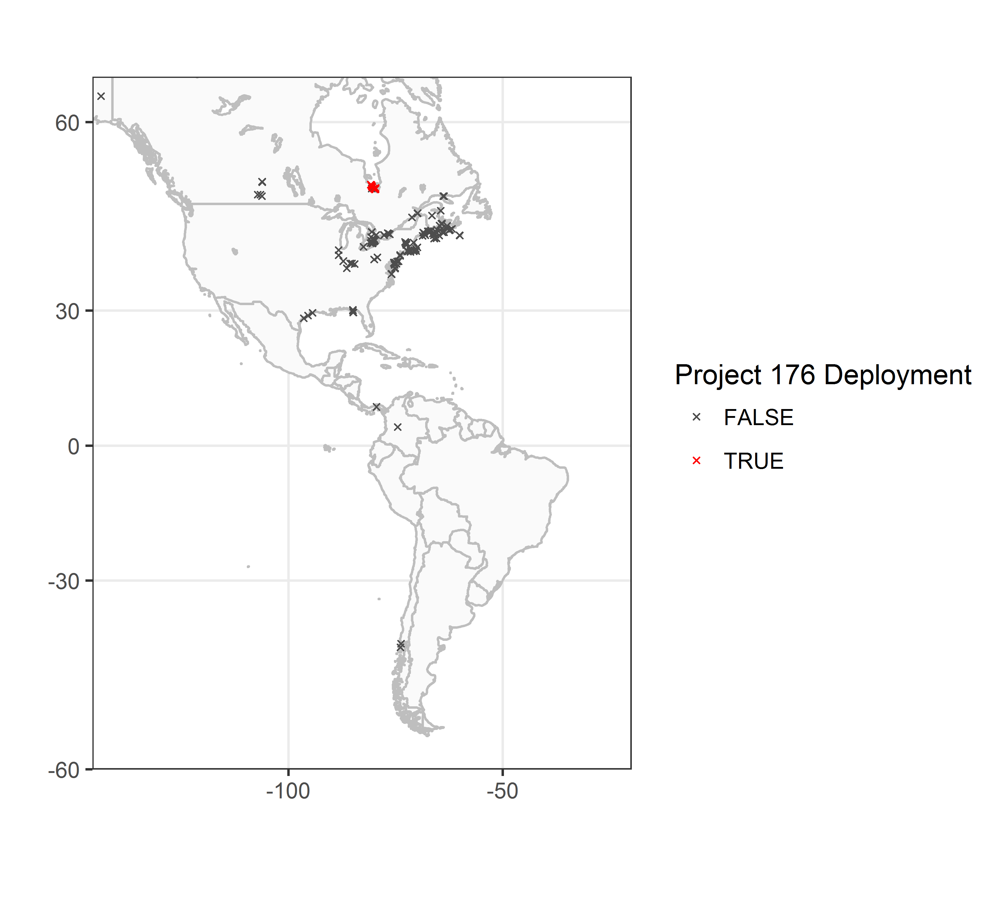

```{r setup, include = FALSE}
# Get and update sample data to avoid messages later
sql.motus <- motus:::get_sample_data()
```


Before working with your detection data, a first step is to summarize and visualize the metadata for tag and receiver deployments registered to your project.
Summarizing and plotting your deployments can be an effective way to find any errors in tag or receiver deployment metadata, which can in turn influence the completeness of the detections data for your project and the projects of others with detections of their own tags on your receivers. 

This chapter is a complement to the online [Data Issues page](https://motus.org/data/issues), which provides each project with a list of metadata issues (missing or outlying values) to be accepted or ignored.
As such, please address any and all errors associated with your project on the [Data Issues page](https://motus.org/data/issues) **before** importing your data through R. 
This chapter does not provide a full check of your deployment metadata, but will help uncover errors that have been missed by the automatic queries on the [Data Issues page](https://motus.org/data/issues).

We use the James Bay Shorebird Project [sample dataset](01-introduction.html#sample-data) throughout this chapter.
As you run through the code to look at your own deployments, **please fix any errors or omissions in your metadata by signing in to <https://motus.org/>**, and under the 'Manage Data' tab, select either 'Manage Tags' to fix tag deployment metadata or 'Manage Receivers' to fix receiver deployment metadata.
It is important to fix metadata errors online, so that errors are fixed at the source and archived on the Motus Server, ensuring all users have access to the correct tag and receiver metadata.
Metadata corrected online will automatically be corrected in your detection files.
If you have already downloaded your detection data, you can update [detections](03-accessing-data.html#update-detections) and [metadata](03-accessing-data.html#update-metadata).

## Setup

Before we begin working with data, we need to load the required packages for this chapter.
If you have not yet installed these packages (from GitHub or CRAN) then please return to [Chapter 2 - Installing packages](02-installing-packages.html).

```{r eval = TRUE, warning = FALSE, message = FALSE}
library(tidyverse)
library(motus)
library(lubridate)

# Set the system environment time zone to UTC (to ensure that you are always working in UTC)
Sys.setenv(TZ = "UTC")
```

## Load `.motus` file

This chapter assumes that the `.motus` file has already been downloaded, if you have not done so please return to [Chapter 3 - Accessing detections data](03-accessing-data.html).
To update and load the existing file into R, use `tagme()`, you may have to [login](03-accessing-data.html#user-authentication) with the username **and** password 'motus.sample'.

```{r}
sql.motus <- tagme(176, update = TRUE, dir = "./data")
```

## Tag Deployments

In your .motus file, when using the tagme function, you are only provided with the metadata for any tags from your project with detections along with metadata for associated ambiguous tags from other projects, and receiver metadata for stations where your tags were detected.

Here we will:

1. download full tag metadata for our project only
2. determine how many tags are registered to your project
3. determine how many of those registered tags were deployed 
4. determine location of tag deployments
5. determine completeness and accuracy of tag deployment metadata

We will run through each of these in sequence.

### Download full project tag metadata 

Incomplete metadata or missing tag registrations can result in missing detection data. 
We therefore want to assess the completeness of all tags registered to our projects - not just tags for which we have detections. 
In order to to this we will use the `metadata()` function for project 176, described in more detail in [Chapter 3](03-accessing-data.html#all-metadata).

```{r eval = FALSE}
metadata(sql.motus, projectIDs = 176)
```

### Number of registered tags

Now that we have complete tag metadata for our project, we can check the number of tags registered by loading the `tags` table in the `.motus` file. 
The `tags` table contains the metadata of each registered tag, including a unique tagID and information on manufacturer, model, nominal and offset frequency, burst interval, and pulse length. 
The `tags` table does not include deployment information. 
We select the metadata specific to the James Bay Shorebird Project, and ignore tag metadata associated with any duplicate tags belonging to other projects:

```{r message = FALSE, warning = FALSE}
tbl.tags <- tbl(sql.motus, "tags") 
df.tags <- tbl.tags %>%
  filter(projectID == 176) %>%
  collect() %>%
  as.data.frame()
```

The number of rows in the `df.tags` database is equivalent to the number of tags registered to the James Bay Shorebird Project in the sample dataset (i.e., 18 tags):

```{r}
nrow(df.tags) # number of registered tags in the database
```

You can view the motusTagIDs:

```{r}
unique(df.tags$tagID)
```
If you are missing registered tags, please follow the instructions at <https://motus.org/tag-registration/>.

### Number of registered tags that were deployed

The tag deployment metadata table (`tagDeps`) in the `.motus` file is required to check which registered tags have deployments. 
This file includes the date, time, species, and location of tag deployment. 
The database is subset to project '176', and we use the `anti_join()` function to determine which registered tags have (or do not have) corresponding deployment information.

```{r message = FALSE, warning = FALSE}
tbl.tagDeps <- tbl(sql.motus, "tagDeps") 

df.tagDeps <- tbl.tagDeps %>%
  filter(projectID == 176) %>%
  collect() %>%
  as.data.frame() %>% # once in df format, can format dates with lubridate
  mutate(tsStart = as_datetime(tsStart, tz = "UTC", origin = "1970-01-01"),
         tsEnd = as_datetime(tsEnd, tz = "UTC", origin = "1970-01-01")) 

anti_join(df.tags, df.tagDeps, by = "tagID") 
```

In the sample data, there are no registered tags without deployment metadata, which suggests that all tags were deployed.
If you have undeployed tags in your own files, please check your records to ensure this is the case; 
without deployment metadata, detections for registered but 'undeployed' tags will be missing from your detections database.

### Number of deployments per tag

A tag might be deployed more than once, for example, if a previously deployed tag was recovered, and then later re-deployed on another individual.
When tags are deployed more than once, the detections data should be considered independently for each deployment. 

Throughout this book we use the `motusTagID` as a unique identifier for a deployment.
However, when a tag is deployed more than once, the `motusTagID` will remain consistent between deployments, and we instead need to use the `tagDeployID`, or combination of `motusTagID` and `tagDeployID` to distinguish which detections belong to which deployment. 

Here, we check whether there are any tags with more than one deployment in the sample data (there are none), and then show you how to make a combined tagID/deployID variable to use in place of the `motusTagID` if you have multiple deployments of a tag in your own data:

```{r}
df.alltags <- tbl(sql.motus, "alltags") %>% 
  collect() %>% 
  as.data.frame() %>%     # for all fields in the df (data frame)
  mutate(ts = as_datetime(ts, tz = "UTC", origin = "1970-01-01"))

df.alltags %>%
  select(motusTagID, tagDeployID) %>%
  filter(!(is.na(tagDeployID))) %>% # remove NA tagDeployIDs
  distinct() %>%
  group_by(motusTagID) %>%
  mutate(n = n()) %>%
  filter(n > 1)
```

If you do have multiple deployments for a tag, we recommend creating a `motusTagDepID` to use in place of the `motusTagID` to define unique deployments of a tag. 
Moving forward, you would use `motusTagDepID` in place of `motusTagID` as you work through the rest of the book:

```{r}
df.alltags <- df.alltags %>%
  mutate(motusTagDepID = paste(motusTagID, tagDeployID, sep = "."))

# and do the same for the tag metadata
df.tagDeps <- df.tagDeps %>%
  mutate(motusTagDepID = paste(tagID, deployID, sep = "."))
```

### Location of tag deployments

Creating a map of your tag deployments can point out any obvious errors in the tag deployment latitude or longitude that weren't captured by the online metadata message centre queries.

**a. Load base map files**

Load base map files from the `rworldmap` package:

```{r eval = FALSE, message = FALSE, warning = FALSE}
na.lakes <- map_data(map = "lakes")
na.lakes <- mutate(na.lakes, long = long - 360)

# Include all of the Americas to begin
na.map <- map_data(map = "world2")
na.map <- filter(na.map, region %in% c("Canada", "USA"))
                               
na.map <- mutate(na.map, long = long- 360)
                
# Others countries in the Americas that you may want to plot, depending on your
# location: "Mexico", "lakes","Belize", "Costa Rica", "Panama", "Guatemala",
# "Honduras", "Nicaragua", "El Salvador", "Colombia", "Venezuela", "Ecuador",
# "Peru", "Brazil", "Guyana","Suriname", "Bolivia", "French Guiana", "Jamaica",
# "Cuba", "Haiti", "Dominican Republic", "The Bahamas", "Turks and Caicos
# Islands", "Puerto Rico", "British Virgin Islands", "Montserrat", "Dominica",
# "Saint Lucia", "Barbados", "Grenada", "Trinidad and Tobago", "Chile",
# "Argentina", "Uruguay"

```

**b. Map the locations of tag deployments**

Map the location of tag deployments for the sample data: 

```{r eval = FALSE, message = FALSE, warning = FALSE}
# set limits to map based on locations of detections, ensuring they include the
# deployment locations
xmin <- -100 #min(df.tagDeps$longitude, na.rm = TRUE) - 5
xmax <- max(df.tagDeps$longitude, na.rm = TRUE) + 5
ymin <- min(df.tagDeps$latitude, na.rm = TRUE) - 5
ymax <- max(df.tagDeps$latitude, na.rm = TRUE) + 5
                
# map using ggplot
ggplot(data = na.lakes, aes(x = long, y = lat)) + 
  geom_polygon(data = na.map, aes(long, lat, group = group), 
               colour = "grey", fill="grey98") + 
  geom_polygon(aes(group = group), colour = "grey", fill = "white") +
  coord_map(projection = "mercator", 
            xlim = c(xmin, xmax), 
            ylim = c(ymin, ymax)) +
  labs(x = "", y = "") + 
  theme_bw() + 
  geom_point(data = filter(df.tagDeps, projectID == 176), 
             aes(longitude, latitude), size = 2, shape = 1, colour = "red")

```

```{r echo=FALSE, fig.align='center'}
knitr::include_graphics("images/mapRecvs1.png")
```

If there are any errors in tag deployment location, please correct these online at <https://motus.org/data/>.

### Check completeness and accuracy of tag deployment metadata

Required tag metadata includes deployment start date/time, end date/time (if applicable), deployment latitude, deployment longitude, and species.
Lack of information on deployment date, time, and location in particular can influence the estimated lifespan of your tag, and therefore whether the tagFinder will 'look' for your tag at the appropriate time(s). 
It can also increase the potential for ambiguities with duplicate tags in the system. 

**a. Look at range of metadata values**

As a first step, use `summary(df.tagDeps)` to get an idea of the range of each variable, and whether any variables have missing (`NA`) or odd values.
The following summarizes a subset of the variables in the `df.tagDeps` database.
There are several things to consider: are the range of start and end dates reasonable for your deployments, or are there obvious errors in the timing of deployments?
Is the range in deployment latitude and longitude reasonable? Are the values for species IDs correct?  

```{r}
df.tagDeps %>%
  select(tagID, projectID, tsStart, tsEnd, speciesID, latitude, longitude) %>%
  summary()
```

There are no missing start dates (`tsStart`), and deployment start dates range from `r min(year(df.tagDeps$tsStart))` to `r max(year(df.tagDeps$tsStart))`, which is reasonable for this project.  

The species IDs are numeric, and somewhat meaningless without an ability to assign an actual species name to the numeric ID, which we do next, however there are no missing values. 

**b. Check that species IDs are appropriate for your data**

The `species` table in the .motus file associates each numeric species ID with an English, French, and scientific name.
We load that table, and subset to the suite of numeric `speciesID`s in the tag metadata:

```{r}
# generate list of species IDs in project 176 metadata
sp.list <- unique(df.tagDeps$speciesID)  

# Species metadata
tbl.species <- tbl(sql.motus, "species") 
tbl.species %>%
  filter(id %in% sp.list) %>%
  collect() %>%
  as.data.frame()
```

This lists all species that are included in the tag deployment metadata for the project. If there are species that do not make sense, this is likely due to a data entry error when assigning a deployment to a species. You can look for records in your tag metadata that are associated with a particular `speciesID` using the following code; you would then use the `deployID` associated with the entry/entries to find and update the deployment record in your project metadata online:

```{r}
filter(df.tagDeps, speciesID == 4780)
```


**Please remember, any metadata corrections need to be made online**

## Check Receiver Metadata

There are two sources of receiver metadata in Motus detection data: receivers registered to your own project, and receivers registered to the projects of others. 
You can access metadata for all receivers in the network, because negative data (i.e., my tag was *not* detected at station X even though station X was active) is often as important as positive data.
It also allows you to map where your tags were detected relative to the distribution of receivers throughout the Motus network.

Receiver metadata errors or omissions that you find in your `.motus` file can only be fixed for receivers registered to your own project. 

All users are encouraged to enter complete and accurate receiver metadata for the benefit of the entire network.
If you anticipate needing specific information on receiver or antenna deployments for stations deployed by others, please consider using the Motus discussion group (<https://motus.org/discussion/>) to request that other registered users record the receiver deployment details you will need; 
be specific about the exact receiver deployment details you are interested in, and when and where in the network your tags will be deployed and potentially detected. 

In the following steps we will:

1. download full receiver metadata across the network
2. determine number of project receiver deployments
3. determine timing of project receiver deployments
4. determine location of network-wide and project receiver deployments
5. determine completeness and accuracy of receiver metadata

### Download full receiver metadata 

Later on in this chapter we will want to map all receivers in the network, so we will now load metadata from all projects, as opposed to simply project 176 as we did above.
The `metadata()` function is described in more detail in [Chapter 3](03-accessing-data.html#all-metadata)

```{r eval = FALSE}
metadata(sql.motus)
```

### Number of project receiver deployments

To see which (if any) receiver deployments are registered to your project, import, subset and summarize the receiver deployment data:

```{r}
tbl.recvDeps <- tbl(sql.motus, "recvDeps") 

df.projRecvs <- tbl.recvDeps %>%
  filter(projectID == 176) %>%
  collect() %>%
  as.data.frame() %>%
  mutate(tsStart = as_datetime(tsStart, tz = "UTC", origin = "1970-01-01"),
         tsEnd = as_datetime(tsEnd, tz = "UTC", origin = "1970-01-01"))

summary(df.projRecvs)
```

There are `r nrow(df.projRecvs)` receiver deployments registered to the sample project.
Four deployments are missing latitude and longitude, and six deployments are missing end dates, which suggests that those receivers are still deployed. 

The following code keeps only variables of interest (by removing those we do not need), and arranges the remaining records by receiver ID, latitude, and start date:

```{r}
df.projRecvs %>%
  mutate(dateStart = date(tsStart)) %>% 
  select(-serno,-fixtureType, -macAddress, -tsStart, -tsEnd, -elevation, 
         -projectID, -status, -receiverType, -siteName) %>%
  arrange(deviceID, latitude, dateStart)
```

The number of receiver deployments in the metadata should correspond with the number of field deployments. 

Looking at the `isMobile` column for the four receiver deployments that are missing latitude and longitude information, it is evident that these are mobile receivers that do not have a fixed position (ie. they have a value of 1). Because they are mobile, coordinates of the deployment aren't expected, and in this case will remain `NA`. Receiver deployment coordinates for mobile receivers, when present, are meant to represent the starting point for the deployment.

### Timing of project receiver deployments

The timing of deployments can be displayed graphically; horizontal line(s) in the following plot show the time span for each receiver (`deviceID`) deployment registered to the James Bay Shorebird Project. Note that for the two receivers without deployment end dates, the code assigns an arbitrary end date based on the maximum end date of the other receivers plus one month - without this fix, deployments without end dates do not get displayed. Different deployments of the same receiver should not overlap in time:

```{r warnings = FALSE, messages = FALSE}

# put data in long format to simplify plotting (or use geom_segment)
df.projRecvs.long <- df.projRecvs %>%
  select(deviceID, deployID, tsStart, tsEnd) %>% 
  gather(when, ts, c(tsStart, tsEnd)) %>%
  # fake end date:
  mutate(ts = if_else(is.na(ts), max(ts, na.rm = TRUE) + duration(1, "month"), ts)) 

ggplot(data = df.projRecvs.long, 
       aes(x = ts, y = as.factor(deviceID), colour = as.factor(deployID))) +
  theme(legend.position = "none") +
  geom_line(lwd = 3) + 
  # instead, centre to the right
  geom_text(data = filter(df.projRecvs.long, when == "tsStart"), 
            aes(label = deployID), hjust = "left", nudge_y = 0.2, size = 3, angle = 45) +
  theme_bw() +
  labs(x = "Year", y = "Receiver ID")
```

If you want more detail for a given year (or all years) you can either subset and re-plot, or use the day of year on the x-axis, and `facet_wrap()` by year. 

```{r}
ggplot(data = df.projRecvs.long, 
       aes(x = yday(ts), y = as.factor(deviceID), colour = as.factor(deployID))) +
  theme_bw() +
  theme(legend.position = "none") + 
  geom_line(lwd = 3) + 
  # centre labels to the left
  geom_text(data = filter(df.projRecvs.long, when == "tsStart"), 
            aes(label = deployID), hjust = "left", nudge_y = 0.4, size = 3) +
  labs(x = "Day of year", y = "Receiver ID") +
  facet_grid(year(ts) ~ ., scales = "free")
  
```

### Location of receiver deployments

Maps provide better spatial context than simple plots; 
the following steps plot the location of Motus receivers on a map of North America, with receivers deployed by the sample project displayed in red.

**a. Load all receiver metadata**
```{r message = FALSE, warning = FALSE}
df.recvDeps <- tbl.recvDeps %>%
  collect() %>%
  as.data.frame() %>%
  mutate(tsStart = as_datetime(tsStart, tz = "UTC", origin = "1970-01-01"),
         tsEnd = as_datetime(tsEnd, tz = "UTC", origin = "1970-01-01"))
```

**b. Load base map files**

```{r eval = FALSE, message = FALSE, warning = FALSE}
na.lakes <- map_data(map = "lakes")
na.lakes <- mutate(na.lakes, long = long - 360)

# Include all of the Americas to begin
na.map <- map_data(map = "world2")
na.map <- filter(na.map, 
                 region %in% c("Canada", "USA", "Mexico", "lakes", "Belize", 
                               "Costa Rica", "Panama", "Guatemala", "Honduras", 
                               "Nicaragua", "El Salvador", "Colombia", "Venezuela", 
                               "Ecuador", "Peru", "Brazil", "Guyana","Suriname", 
                               "Bolivia", "French Guiana", "Jamaica", "Cuba", 
                               "Haiti", "Dominican Republic", "The Bahamas", 
                               "Turks and Caicos Islands", "Puerto Rico", 
                               "British Virgin Islands", "Montserrat", "Dominica", 
                               "Saint Lucia", "Barbados", "Grenada", 
                               "Trinidad and Tobago", "Chile", "Argentina", 
                               "Uruguay", "Paraguay")) %>%
  mutate(long = long - 360)
```

**c. Map the location of receivers in the Americas**
Map showing the location of network-wide receivers (dark grey 'x') and receivers deployed by the James Bay Shorebird Project (project 176; red 'x').

```{r eval = FALSE, message = FALSE, warning = FALSE}
# set map limits using detection locations; 
# ensure they include the deployment locations
xmin <- min(df.recvDeps$longitude, na.rm = TRUE) - 2
xmax <- -20 # restrict to the Americas (excluding a few points in Europe)
ymin <- -60 #min(df.recvDeps$longitude, na.rm = TRUE) - 2
ymax <- max(df.recvDeps$latitude, na.rm = TRUE) + 2
                
# map
ggplot(data = na.lakes, aes(x = long, y = lat)) + 
  theme_bw() + 
  geom_polygon(data = na.map, aes(long, lat, group = group), 
               colour = "grey", fill = "grey98") +
  geom_polygon(aes(group = group), colour = "grey", fill = "white") +
  coord_map(projection = "mercator", xlim = c(xmin, xmax), ylim = c(ymin, ymax)) +
  labs(x = "", y = "") + 
  geom_point(data = df.recvDeps, 
             aes(longitude, latitude, colour = as.logical(projectID == 176)), 
             size = 0.8, shape = 4) +
  scale_colour_manual(values = c("grey30", "red"), name = "Project 176 Deployment") 
```  

```{r fig4.2, echo=FALSE, fig.align='center'}

```

**d. Map the location of project specific receivers only**

Map of project-specific receivers, created by setting the x-axis (longitude) and y-axis (latitude) map limits using the 'df.projRecvs' dataframe created above. Deployments are restricted to those that were active at in 2016.

```{r eval = FALSE, message = FALSE, warning = FALSE}
# set map limits using detection locations;
# ensure they include the deployment locations
xmin <- min(df.projRecvs$longitude, na.rm = TRUE) - 2
xmax <- max(df.projRecvs$longitude, na.rm = TRUE) + 2
ymin <- min(df.projRecvs$latitude, na.rm = TRUE) - 1
ymax <- max(df.projRecvs$latitude, na.rm = TRUE) + 1
                
# map
ggplot(data = na.lakes, aes(x = long, y = lat))+ 
  theme_bw() + 
  geom_polygon(data = na.map, aes(long, lat, group = group), 
               colour = "grey", fill = "grey98") +
  geom_polygon(aes(group = group), colour = "grey", fill = "white") +
  coord_map(projection = "mercator", xlim = c(xmin, xmax), ylim = c(ymin, ymax)) +
  labs(x = "", y = "") +
  geom_point(data = filter(df.projRecvs, 
                           year(tsStart) == 2016, 
                           !is.na(latitude)),  # remove mobile receivers
             aes(longitude, latitude, colour = as.factor(deviceID)), size = 2, shape = 1)+
  scale_colour_discrete(name = "Receiver ID") 
```

```{r echo=FALSE, fig.align='center'}
knitr::include_graphics("images/mapProjRecvs.png")
```

### Completeness and accuracy of receiver metadata

Motus users will be concerned primarily with the completeness of metadata for receiver deployments with detection(s) of their tags, because these can directly influence the interpretation of those detections. 
For example, missing deployment latitude or longitude will result in an unknown location for the tag detection, and missing information on antenna type and/or orientation can impede the estimation of flight or departure orientation. 

In many cases, however, metadata for receiver deployments *without* tag detections can also be useful, for example to estimate probability of detecting an animal that passes within range of a station.

In this section, the focus is on metadata for receivers registered to a particular project. 
Depending on your interests, these summaries can be applied to a larger group of receivers, 
e.g., all receivers with detections or all receivers within certain geographic limits (with or without detections).

**a. Load receiver and antenna metadata**

```{r}
# antenna metadata for ALL Motus antenna deployments; 
# to simplify, keep only the variables of interest.
tbl.antDeps <- tbl(sql.motus, "antDeps") 

df.antDeps <- tbl.antDeps %>%
  select(deployID, port, antennaType, bearing, heightMeters) %>%
  collect() %>%
  as.data.frame()

# receiver deployments; select variables of interest
df.recvDeps <- df.recvDeps %>%
  select(deployID, receiverType, deviceID, name, latitude, longitude, 
         isMobile, tsStart, tsEnd, projectID, elevation) 

df.stationDeps <- left_join(df.recvDeps, df.antDeps, by = "deployID")
```

Subset these to receivers registered to a project:

```{r}
df.stationDeps <- filter(df.stationDeps, projectID == 176)
```

**b. Look at range of metadata values** 

Use `summary()` to get a general idea of the distribution of the variables in the data. 

```{r}
summary(df.stationDeps)
```

There are the 4 deployments with missing latitude and longitude associated with the four deployments of mobile receivers that we saw earlier. 

Elevation is missing from 74 of 91 records, but elevation is not a required field, and can be estimated from other sources, or directly in R ([for example](https://stackoverflow.com/questions/8973695/conversion-for-latitude-longitude-to-altitude-in-r)).

Antenna bearing is missing from 18 of 91 records, and height of the antenna(s) is missing for 4 of 91 records.
Subset the records with missing antenna bearing to see if these can be fixed:

```{r}
df.stationDeps %>%
  filter(is.na(bearing)) %>%
  select(-elevation, -deviceID, -tsEnd)
```

Receiver deployments with missing antenna bearing(s) are restricted to deployments of omni-directional antennas or mobile receivers, and so the missing values make sense.
These records also show that the four records with missing antenna height are also associated with the four mobile receivers, and so again the missing values make sense and do not need to be fixed.  

Remember that any missing metadata needs to be corrected online.
Metadata corrected online will automatically be corrected in your detection files.
If you have already downloaded your detection data, you can update the existing file to include this new data (see [Updating a database in Chapter 3](03-accessing-data.html#updating-a-database).

**Next:** [Chapter 5 - Data cleaning](05-data-cleaning.html)