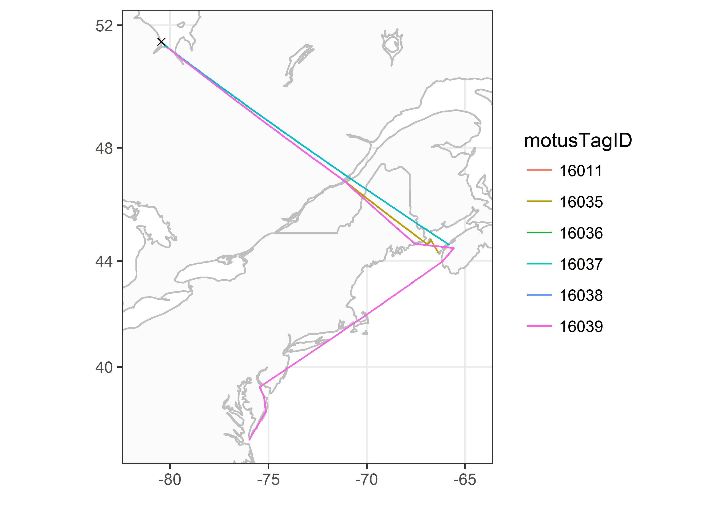

```{r setup, include = FALSE}
# Get and update sample data to avoid messages later
sql.motus <- motus:::get_sample_data()
```


Once you have clarified any possible ambiguous tags, and removed false positives, you are ready to start analyzing your clean data set. 
This chapter will walk you through some simple procedures to start working with and visualizing the clean sample data set;
you can modify these scripts to work with your own data. 
For a more in-depth R tutorial we strongly recommend working through [R for Data Science](http://r4ds.had.co.nz/) by Garrett Grolemund and Hadley Wickham.

## Load required packages

Follow the instructions in [Chapter 2](02-installing-packages.html) to install the following packages before loading, if you haven't already done so.

```{r message = FALSE, warning = FALSE}
library(motus)
library(tidyverse)
library(ggmap)
library(lubridate)

Sys.setenv(TZ = "UTC")
```


## Load data

If you followed along with the the previous Chapter ([Chapter 5 - Data cleaning](05-data-cleaning.html)) and are working with the cleaned `df.alltags.sub` file, you can skip this step and go directly to [Summarizing your data](#summarizing-your-data).  

Otherwise, if you saved your data as an RDS file, you can load it using:

```{r}
df.alltags.sub <- readRDS("./data/dfAlltagsSub.rds") # change dir to local directory
```

Or, if you've applied a custom filter to your `.motus` file, you can load the previously downloaded sample Motus data (see [Chapter 3](03-accessing-data.html)) and clean it now. 
Currently the main benefit of using the custom filter is that you apply the filter to the `.motus` file, which allows you more flexibility in applying `dplyr` functions to manage and filter the data
(e.g., you can select different variables to include in the data than we included in the RDS file in [Chapter 5 - Data cleaning](05-data-cleaning.html)). 
This approach also allows you to more readily integrate new data added to your database with the `tagme()` function. 
Because we are selecting the same variables and filtering the same records, the following gives you the same dataset as the `readRDS` statement above:

```{r}
# load the .motus file (remember 'motus.sample' is both username and password)
sql.motus <- tagme(176, update = TRUE, dir = "./data/")
tbl.alltags <- tbl(sql.motus, "alltagsGPS")

# obtain a table object of the filter
tbl.filter <- getRunsFilters(sql.motus, "filtAmbigFalsePos")

# filter and convert the table into a dataframe, with a few modications
df.alltags.sub <- left_join(tbl.alltags, tbl.filter, by = c("runID", "motusTagID")) %>%
  mutate(probability = ifelse(is.na(probability), 1, probability),
         recvLat = if_else((is.na(gpsLat)|gpsLat == 0|gpsLat == 999), 
                           recvDeployLat, 
                           gpsLat),
         recvLon = if_else((is.na(gpsLon)|gpsLon == 0|gpsLon == 999), 
                           recvDeployLon, 
                           gpsLon),
         recvAlt = if_else(is.na(gpsAlt), 
                           recvDeployAlt, 
                           gpsAlt)) %>%
  filter(probability > 0) %>%
  select(-noise, -slop, -burstSlop, -done, -bootnum, -codeSet, 
         -mfg, -nomFreq, -markerNumber, -markerType, -tagDepComments, 
         -fullID, -deviceID, -recvDeployLat, -recvDeployLon, -recvDeployAlt, 
         -speciesGroup, -gpsLat, -gpsLon, -recvAlt, -recvSiteName) %>%
  collect() %>%
  as.data.frame() %>%
  mutate(ts = as_datetime(ts),  # work with dates AFTER transforming to flat file
         tagDeployStart = as_datetime(tagDeployStart),
         tagDeployEnd = as_datetime(tagDeployEnd),
         recvDeployName = if_else(is.na(recvDeployName), 
                                  paste(recvLat, recvLon, sep=":"), 
                                  recvDeployName))

```

**Note that if your project is very large, you may want to convert only a portion of it to the dataframe, to avoid memory issues.** 

Details on filtering the tbl prior to collecting as a dataframe are available in [Converting to flat file in Chapter 3](03-accessing-data.html#converting-to-flat-file).  

Here we do so by adding a filter to the above command, in this case, only creating a dataframe for `motusTagID` 16047, but you can decide how to best subset your data based on your need (e.g. by species or year):

```{r}
# create a subset for a single tag, to keep the dataframe small
df.alltags.16047 <- filter(df.alltags.sub, motusTagID == 16047) 
```

## Summarizing your data

Here we will run through some basic commands, starting with the `summary()` function to view a selection of variables in a data frame:

```{r}
sql.motus %>% 
  tbl("alltags") %>% 
  select(ts, motusTagID, runLen, speciesEN, tagDepLat, tagDepLon, 
         recvDeployLat, recvDeployLon) %>% 
  collect() %>%
  summary()

# same summary for the filtered sql data
df.alltags.sub %>% 
  select(ts, motusTagID, runLen, speciesEN, tagDepLat, tagDepLon, 
         recvLat, recvLon) %>% 
  summary()
```

The `dplyr` package allows you to easily summarize data by group, manipulate variables, or create new variables based on your data.  

We can manipulate existing variables or create new ones with `dplyr`'s `mutate()` function, here we'll convert ts to a POSIXct format, then make a new variable for year and day of year (doy).

We'll also remove the set of points with missing receiver latitude and longitudes. 
These may be useful in some contexts (for example if the approximate location of the receiver is known) but can cause warnings or errors when plotting. 

```{r}
df.alltags.sub <- df.alltags.sub %>%
  mutate(ts = as_datetime(ts, tz = "UTC"), # convert ts to POSIXct format
         year = year(ts), # extract year from ts
         doy = yday(ts)) %>% # extract numeric day of year from ts
  filter(!is.na(recvLat))

head(df.alltags.sub)
```

We can also summarize information by group, in this case `motusTagID`, and apply various functions to these groups such as getting the total number of detections (n) for each tag, the number of receivers each tag was detected on, the first and last detection date, and the total number of days there was at least one detection:

```{r}
tagSummary <- df.alltags.sub %>%
  group_by(motusTagID) %>% 
  summarize(nDet = n(),
            nRecv = length(unique(recvDeployName)),
            tsMin = min(ts),
            tsMax = max(ts),
            totDay = length(unique(doy)))

head(tagSummary)
```

We can also group by multiple variables; 
applying the same function as above but now grouping by `motusTagID` and `recvDeployName`, we will get information for each tag detected on each receiver. 
Since we are grouping by `recvDeployName`, there will be by default only one `recvDeployName` in each group, thus the variable `nRecv` will be 1 for each row. 
This in not very informative, however we include this to help illustrate how grouping works:

```{r}
tagRecvSummary <- df.alltags.sub %>%
  group_by(motusTagID, recvDeployName) %>% 
  summarize(nDet = n(),
            nRecv = length(unique(recvDeployName)),
            tsMin = min(ts),
            tsMax = max(ts),
            totDay = length(unique(doy)))

head(tagRecvSummary)
```

## Plotting your data

Plotting your data is a powerful way to visualize broad and fine-scale detection patterns.
This section will give you a brief introduction to plotting using `ggplot2.`
For more in depth information on the uses of `ggplot2`, we recommend the [Cookbook for R](http://www.cookbook-r.com/Graphs/), and the Rstudio [`ggplot2` cheatsheet](https://www.rstudio.com/wp-content/uploads/2015/03/ggplot2-cheatsheet.pdf).  

To make coarse-scale plots with large files, we suggest first rounding the detection time to the nearest hour or day so that processing time is faster.
Here we round detection times to the nearest hour, then make a basic plot of hourly detections by `motusTagID`:

```{r}
df.alltags.sub.2 <- df.alltags.sub %>%
  mutate(hour = as.POSIXct(round(ts, "hour"))) %>% 
  select(motusTagID, port, tagDeployStart, tagDepLat, tagDepLon, 
         recvLat, recvLon, recvDeployName, antBearing, speciesEN, year, doy, hour) %>% 
  distinct()

ggplot(data = df.alltags.sub.2, aes(x = hour, y = as.factor(motusTagID))) +
  theme_bw() +
  geom_point() + 
  labs(x = "Time (rounded to hour)", y = "MotusTagID")
```

Let's focus only on tags deployed in 2016, and we can colour the tags by species:

```{r}
ggplot(data = filter(df.alltags.sub.2, year(tagDeployStart) == 2016), 
       aes(x = hour, y = as.factor(motusTagID), colour = speciesEN)) +
  theme_bw() + 
  geom_point() +
  labs(x = "Time (rounded to hour)", y = "MotusTagID") +
  scale_colour_discrete(name = "Species")
```

We can see how tags moved latitudinally by first ordering by hour, and colouring by `motusTagID`:

```{r warnings = FALSE}
df.alltags.sub.2 <- arrange(df.alltags.sub.2, hour)

ggplot(data = filter(df.alltags.sub.2, year(tagDeployStart) == 2016), 
       aes(x = hour, y = recvLat, col = as.factor(motusTagID), 
           group = as.factor(motusTagID))) + 
  theme_bw() + 
  geom_point() +
  geom_path() +
  labs(x = "Time (rounded to hour)", y = "Receiver latitude") +
  scale_colour_discrete(name = "MotusTagID")
```

Now lets look at more detailed plots of signal variation. 
We use the full `df.alltags.sub` dataframe so that we can get signal strength for each detection of a specific tag.
Let's examine fall 2016 detections of tag 22897 at Niapiskau; we facet the plot by deployment name, ordered by decreasing latitude:

```{r}
ggplot(data = filter(df.alltags.sub, 
                     motusTagID == 22897, 
                     recvDeployName == "Niapiskau"), 
       aes(x = ts, y = sig)) +
  theme_bw() + 
  geom_point() + 
  labs(x = "Time", y = "Signal strength") +
  facet_grid(recvDeployName ~ .)
```

We use the `sunRiseSet()` to get sunrise and sunset times for all detections. 
We then zoom in on a certain timeframe and add that information to the above plot by adding a `geom_vline()` statement to the code, which adds a yellow line for sunrise time, and a blue line for sunset time:

```{r}
# add sunrise and sunset times to the dataframe
df.alltags.sub <- sunRiseSet(df.alltags.sub, lat = "recvLat", lon = "recvLon") 

ggplot(data = filter(df.alltags.sub, motusTagID == 22897,
                     ts > ymd("2016-10-11"),
                     ts < ymd("2016-10-17"),
                     recvDeployName == "Niapiskau"), 
       aes(x = ts, y = sig)) +
  theme_bw() + 
  geom_point() + 
  labs(x = "Time of year", y = "Signal strength") +
  geom_vline(aes(xintercept = sunrise), col = "orange") + 
  geom_vline(aes(xintercept = sunset), col = "blue")
```

We can see that during this period, the tag was most often detected during the day, suggesting it may be actively foraging in this area during this time.  

The same plots can provide valuable movement information when the receivers are ordered geographically. We do this for `motusTagID` 16039:

```{r}
# We'll first order sitelat by latitude (for plots)
df.alltags.sub <- mutate(df.alltags.sub, 
                         recvDeployName = reorder(recvDeployName, recvLat))

ggplot(data = filter(df.alltags.sub, 
                     motusTagID == 16039,
                     ts < ymd("2015-10-01")), 
       aes(x = ts, y = recvDeployName)) +
  theme_bw() + 
  geom_point() + 
  labs(x = "Time of year", y = "Receiver name (ordered by latitude)")
```

We zoom in on a section of this plot and look at antenna bearings to see directional movement past stations:

```{r}
ggplot(data = filter(df.alltags.sub, motusTagID == 16039, 
                     ts > ymd("2015-09-14"), 
                     ts < ymd("2015-10-01")), 
       aes(x = ts, y = sig, col = as.factor(antBearing))) +
  theme_bw() + 
  geom_point() + 
  labs(x = "Time of day", y = "Signal strength") +
  scale_color_discrete(name = "Antenna bearing") +
  facet_grid(recvDeployName ~ .)
```

This plot shows the typical flyby pattern of a migrating animal, with signal strength increasing and then decreasing as the tag moves through the beams of the antennas.

## Mapping your data

To generate maps of tag paths, we will once again use summarized data so we can work with a much smaller database for faster processing.
Here we'll summarize detections by day.
As we did in [Chapter 5 - Data cleaning](05-data-cleaning.html), we create a simple function to summarize the data, since we will likely want to do this type of summary over and over again. 

```{r}
# Simplify the data by summarizing by the runID
# If you want to summarize at a finer (or coarser) scale, you can also create
# other groups. The simplest alternative is a rounded timestamp variable; for
# example by using mutate(ts.h = plyr::round_any(ts, 3600) function call. Other
# options are to just use date (e.g date = as_date(ts))

fun.getpath <- function(df) {
  df %>%
    filter(tagProjID == 176, # keep only tags registered to the sample project
           !is.na(recvLat) | !(recvLat == 0)) %>% 
    group_by(motusTagID, runID, recvDeployName, ambigID, 
             tagDepLon, tagDepLat, recvLat, recvLon) %>%
    summarize(max.runLen = max(runLen), ts.h = mean(ts)) %>%
    arrange(motusTagID, ts.h) %>%
    data.frame()
} # end of function call

df.alltags.path <- fun.getpath(df.alltags.sub)
```

```{r}
df.alltags.sub.path <- df.alltags.sub %>%
  filter(tagProjID == 176) %>% # only tags registered to project
  arrange(motusTagID, ts) %>%       # order by time stamp for each tag
  mutate(date = as_date(ts)) %>%    # create date variable
  group_by(motusTagID, date, recvDeployName, ambigID, 
           tagDepLon, tagDepLat, recvLat, recvLon)

df.alltags.path <- fun.getpath(df.alltags.sub.path)
```

### Mapping with the `ggmap` package

Mapping with `ggmap` can be a fast way to view flight paths and allows you to select from multiple base layers.  
There are several ways to use the `ggmap` package. 
One is with Google Maps, which, as of October 16, 2018, requires a Google Maps API key (see Appendix B section \@ref(googleMapsKey) for more details).
An alternative method is to use an open source of map tiles, such as Stamen Map tiles, which do not require an API key. The following example uses Stamen Map tiles.

The first step is to create a map with a specified map are, maptype ("terrain", "toner", or "watercolor", among others), and level of zoom (integer for zoom 3-21, 3 being continent level, 10 being city-scale. 
For stamen maps this represents the level of detail you want).
We then add points for receivers and lines connecting consecutive detections by `motusTagID.`
We can also add points for all receivers that were active during a certain time period if we have already downloaded all metadata.

```{r message = FALSE}
gmap <-  get_stamenmap(bbox = c(left = -90, right = -57, bottom = 35, top = 55),
                       maptype = "terrain-background", # select maptype
                       zoom = 6) # zoom, must be a whole number

# just use the tags that we have examined carefully and filtered (in the
# previous chapter)
df.tmp <- df.alltags.path %>%
  filter(motusTagID %in% c(16011, 16035, 16036, 16037, 16038, 16039)) %>%
  arrange(ts.h)  %>% # arange by hour
  as.data.frame()

ggmap(gmap) +
  theme_bw() + 
  geom_point(data = df.tmp, aes(x = recvLon, y = recvLat), 
             shape = 21, colour = "black", fill = "yellow") +
  geom_path(data = df.tmp, 
            aes(x = recvLon, y = recvLat, group = motusTagID, col = as.factor(motusTagID))) +
  scale_color_discrete(name = "MotusTagID")
```

We make the same plot, with additional points for all receivers that were active during a specified time (concentrating on our area of interest):

```{r warning = FALSE, message = FALSE, fig.width=10, fig.height=10}
# get receiver metadata
tbl.recvDeps <- tbl(sql.motus, "recvDeps")
df.recvDeps <- tbl.recvDeps %>% 
  collect() %>% 
  as.data.frame() %>% 
  mutate(tsStart = as_datetime(tsStart, tz = "UTC", origin = "1970-01-01"),
         tsEnd = as_datetime(tsEnd, tz = "UTC", origin = "1970-01-01"),
         # for deployments with no end dates, make an end date a year from now
         tsEnd = if_else(is.na(tsEnd), 
                         as.POSIXct(format(Sys.time(), "%Y-%m-%d %H:%M:%S")) +
                           dyears(1), 
                         tsEnd), 
         tsEnd = as.POSIXct(tsEnd, tz = "UTC", origin = "1970-01-01"))

# get running intervals for all receiver deployments
siteOp <- with(df.recvDeps, interval(tsStart, tsEnd))

# set the date range you're interested in
dateRange <- interval(as.POSIXct("2015-08-01"), as.POSIXct("2016-01-01"))

# create new variable "active" which will be set to TRUE if the receiver was
# active at some point during your specified date range, and FALSE if not
df.recvDeps$active <- int_overlaps(siteOp, dateRange) 

# create map with receivers active during specified date range as red, and
# receivers with detections as yellow
ggmap(gmap) +
  theme_bw() + 
  geom_point(data = subset(df.recvDeps, active == TRUE), 
             ggplot2::aes(x = longitude, y = latitude), 
             shape = 21, colour = "black", fill = "red") +
  geom_point(data = df.tmp, aes(x = recvLon, y = recvLat), 
             shape = 21, colour = "black", fill = "yellow") +
  geom_path(data = df.tmp, 
            aes(x = recvLon, y = recvLat, group = motusTagID, 
                col = as.factor(motusTagID))) +
  scale_color_discrete(name = "MotusTagID")
```

### Creating simple outline maps

We load the base maps.

```{r}
na.lakes <- map_data(map = "lakes")
na.lakes <- mutate(na.lakes, long = long- 360)

# Include all of the Americas to begin
na.map <- map_data(map = "world2") %>%
  filter(region %in% c("Canada", "USA")) %>%
  mutate(long = long - 360)
```

Then, to map the paths, we set the x-axis and y-axis limits based on the location of receivers with detections. 
Depending on your data, these might need to be modified to encompass the deployment location of the tags, if tags were not deployed near towers with detections. 
We then use `ggplot` to plot the map and tag paths. 
Here we use the Mercator projection and are colouring the paths by `motusTagID`, including a point for where the tag was deployed:

```{r}
# set limits to map based on locations of detections, ensuring they include the
# deployment locations
xmin <- min(df.tmp$recvLon, na.rm = TRUE) - 2
xmax <- max(df.tmp$recvLon, na.rm = TRUE) + 2
ymin <- min(df.tmp$recvLat, na.rm = TRUE) - 1
ymax <- max(df.tmp$recvLat, na.rm = TRUE) + 1

# map
ggplot(data = na.lakes, aes(x = long, y = lat))+ 
  theme_bw() + 
  geom_polygon(data = na.map, aes(x = long, y = lat, group = group), 
               colour = "grey", fill = "grey98") +
  geom_polygon(aes(group = group), colour = "grey", fill = "white") +
  coord_map(projection = "mercator", xlim = c(xmin, xmax), ylim = c(ymin, ymax)) +
  labs(x = "", y = "") +
  geom_path(data = df.tmp, 
            aes(x = recvLon, y = recvLat, 
                group = as.factor(motusTagID), colour = as.factor(motusTagID))) +
  geom_point(data = df.tmp, 
             aes(x = tagDepLon, y = tagDepLat), colour = "black", shape = 4) +
  scale_colour_discrete("motusTagID") 
```

```{r echo=FALSE, fig.align='center'}
#
```

The functions above provide examples of how you can begin exploring your data and are by no means exhaustive. 
