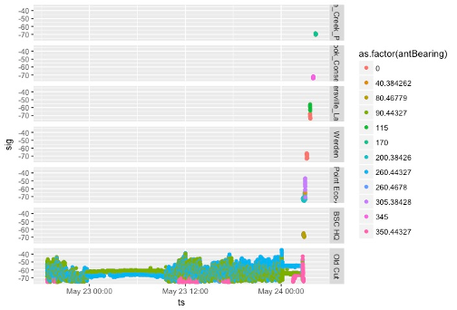
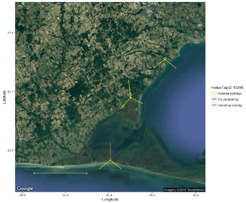

> This article was contributed by Ana Morales and Tara Crewe using data collected by Morbey et al. (2017) (see [sample data](01-introduction.html#sample-datasets)), 
and with financial support from a NSERC CREATE Environmental Innovation Program internship awarded to A.M. through McGill University, with partner Birds Canada (T.C.).

Estimating the orientation of a bird departing a stopover site may be key in certain migration studies.
In the context of an automated radio-telemetry study, the estimated departure direction is often called a vanishing bearing (Sjöberg and Nilsson 2015).
The ability to use characteristics of signal detections to estimate the vanishing bearing of a migrating animal is particularly important at sites where additional stations are not available to capture the flight path following departure from a stopover site.

Sjöberg and Nilsson (2015) calculated vanishing bearings using ordinary circular statistics to estimate the mean of the receiving antenna bearings over the last 5-10 minutes of detections, with the bearing of each detection weighted by strength of the signal.
In other words, every signal detected was a vector pointing in the direction of the receiving antenna, with the length of the vector represented by signal strength. A stronger signal would therefore get a longer vector and a higher weight than a weaker signal. 

This chapter will show you how to estimate the departure bearing of your tagged birds using Sjöberg and Nilsson's method.
You can modify these scripts to work with your own data, or use the sample data provided. 
Before you begin, there are a few assumptions and potential weaknesses you should be aware of: 

## Things to be aware of

1) **This method assumes that the tagged animal is departing from the general location of the receiving station, and moving radially away from the station**. 

It is really important to note that this method **WILL NOT WORK** unless this assumption is met. 
Because tagged individuals most likely aren't departing from the exact location of the receiver station, they should be considered coarse estimates of departure orientation. 

The deviation between estimated vanishing bearings and actual departure orientation that results from birds departing from locations removed from a station is called parallax error. 
Parallax error can be minimized by analyzing only departures in which we can be confident from signal strength characteristics that an individual departed from fairly close to the receiving station. 
Using radar data, Sjöberg and Nilsson (2015) estimated parallax error to be +- 10 degrees when the bird departed close to the station.

Manual telemetry can be used to determine the precise location of an individual during stopover.
In the absence of known location, a good way to know if an individual departed from the general location of a receiving station is to look at the pattern of detections pre- and post-departure.
If an individual departs from near a station, the data will show clear detection patterns by at least two different antennas prior to and during departure.
The following plots use data collected for tagged warblers in spring 2014 and 2015 by Morbey et al. (2017), and show examples of 
a) a tag with a clear departure, and 
b) a tag that does not show a clear departure; 
more information on the data can be found in [Chapter 1's Sample data section](01-introduction.html#sample-datasets) and the [Load the sample data section](#load-the-sample-data) below: 

a) **Good departure**: you can see that the bird stayed in the vicinity of the Old Cut station during stopover, as shown by increased signal variation during the day, and decreased signal variation during the night. 
On the night of departure, the tag shows the usual decrease in activity at night, followed by an increase of activity at around 02:30 am as it departs;
the tag stops being detected by the Old Cut's station soon after, and is then detected by other nearby receivers during its departure flight:  

```{r echo=FALSE, fig.align='center', out.width = "60%"}

```

b) **Unclear departure**: this bird was not detected by the Old Cut station for quite a while, and was only detected during an apparent flyover; 
signal characteristics do not support a clear departure from the station. 
In this case, we do not know how far the bird was from the station during the flyby.
We caution against using examples like this to estimate vanishing bearings: 

```{r echo=FALSE, fig.align='center', out.width = "60%"}
knitr::include_graphics("images/vanishBearing_badDetection.png")
```

2) **The more closely spaced the antennas on a station, the greater the resolution to estimate an accurate vanishing bearing.** 

At the Old Cut field station, three antennas were spaced 120 degrees apart in 2014, and 90 degrees apart in 2015 (facing approximately east, north and west). 
In both years we calculated a coarse departure bearing using the mean of station-to-station bearings for warblers that were detected by multiple stations during departure.
This gave us a known departure direction.
We then calculated vanishing bearings to compare. 

The following is a figure showing the estimated coarse and vanishing bearing for a warbler departing northwards from Old Cut in spring 2014, when the 3 antennas were spaced 120 degrees apart.
The red line represents the estimated vanishing bearing of tag ID 277.
The blue line represents the average coarse bearing based on detections from other stations (red points): 

```{r echo=FALSE, fig.align='center', out.width = "60%"}

```

In the example below, estimated coarse and vanishing bearings are shown for a warbler departing to the north in spring 2015, when Old Cut's antennas were spaced 90 degrees apart.
We can see that the estimated vanishing bearing is pretty close to the coarse bearing estimate. 

```{r echo=FALSE, fig.align='center', out.width = "60%"}
knitr::include_graphics("images/vanishBearing2015.png")
```

Overall, mean deviation between coarse and vanishing bearings was higher in 2014 (n = 14 departures) when antennas were spaced 120 degrees apart, than in 2015 (n = 12 departures) when antennas were spaced 90 degrees apart: 

```{r echo=FALSE, fig.align='center', out.width = "60%"}
knitr::include_graphics("images/vanishBearingDeviation.png")
```

This suggests that stations with closer spaced antennas yield more accurate vanishing bearings.
If the estimation of vanishing bearings is a primary goal of your research, we suggest spacing antennas 60 degrees apart, as in Sjöberg and Nilsson (2015).

3) **For receivers with negative signal strength values, weights need to be normalized**

When calculating weighted circular means, negative weights cannot be used. 
We therefore recommend normalizing the signal strength values by subtracting the minimum signal strength, and dividing by the difference between min and max signal strength, 
i.e., using `sig.norm = (sig - min(sig))/(max(sig)-min(sig))`. 
Further, we suggest using the min and max signal strength at a station, across **all data** collected by the station, so that the full range of potential signal strength values are used in the normalization equation. 
We found that normalizing using the min and max signal strength for an individual departure can result in spurious vanishing bearing estimates if the range in signal strengths observed was not large. 
Using the full range of signal strength values in a project database will avoid this.

## Estimate vanishing bearings: step-by-step

We now walk through how to estimate vanishing bearings in the following steps:

1. Load required R packages
2. Load the data
3. Select individuals that show clear departures from the station
4. Get departure time for each individual
5. Estimate vanishing bearings
6. Plot vanishing bearing on a map

### Load the required packages

First install the following packages with `install.packages()` (see [Chapter 2 - Installing packages](02-installing-packages.html) for help), then load them:

```{r warning = FALSE, message = FALSE}
library(circular)
library(tidyverse)
library(motus)
library(ggplot2)
library(jpeg)
library(ggmap)
library(lubridate)

#Make sure working in UTC 
Sys.setenv(TZ = "UTC")
```

### Load the sample data

The sample data used in this chapter includes the detections of three Magnolia Warblers that were tagged at the Old Cut field research station of the Long Point Bird Observatory in Ontario, Canada, by Morbey et al. (2017).
The warblers were tagged and released in spring 2015.

The sample data are included in the `motusData` R package as the "vanishBearing.rda" file.
In order to access these data, you will need to first [install](02-installing-packages.html) the `motusData` package, *prior* to running the code in this chapter: 

```{r warning = FALSE, message = FALSE}
# load the motusData package, which contains the sample data for this chapter
library(motusData) 

# Load the sample data we provided from 3 individual warblers departing Old Cut
# during the Spring of 2015.

# We also do a couple manipulations here, to reorder the levels of the
# recvSiteName factor, and order the data by ts.

df.vanish <- vanishBearing %>%
  mutate(recvSiteName = reorder(recvSiteName, recvLat),
         motusTagID = as.factor(as.character(motusTagID))) %>% # order sites by latitude
  arrange(ts) # arrange by ts
```

### Select individuals that show clear departure detections

First, we subset the data to the individuals that showed clear departures from the stopover site of interest. 
In fact, the sample data only includes three departures of birds we *know* have clear departures from Old Cut, but we show this step here regardless! 

By selecting only clear departures, we make sure that the bird departed from nearby the station, minimizing the potential for parallax error.
We look for clear departures by first plotting latitude against time.
In this case, we can see the birds departing north past several stations:

```{r}
ggplot(data = df.vanish, aes(x = ts, y = recvLat, colour = as.factor(recvSiteName))) + 
  geom_point(pch = 21) +
  facet_wrap(~ motusTagID, scales = "free", ncol = 1) +
  theme_bw()
```

We also make sure that the bird was being detected by several antennas at once during departure; 
if detections are on only one antenna, the vanishing bearing will simply be the direction of the lone antenna with detections. 
We plot signal strength by time for a subset of the data, to show the last few hours of detections of the bird at Old Cut. Let's try this with tag # 16823 from our sample data:


```{r}
ggplot(data = filter(df.vanish, motusTagID == 16823, ts > "2015-05-30 00:00:00"), 
       aes(x = ts, y = sig, colour = as.factor(port))) + 
  theme_bw() + 
  geom_point(pch = 21) +
  facet_grid(recvSiteName ~ .)
```

We can see the typical detection pattern of a bird departing from a site, shown by a decrease in movement (beginning to roost) at around 00:25 UTC, followed by an increase in activity and departure from the site later in the night after 03:00 UTC. 
Soon after leaving the site, it gets detected by five other stations further north. 
Because this bird was detected before and during departure, we can assume it has departed from somewhat close to the Old Cut station. 

With your own data, look at plots like these for each of your tagged individuals, and for the purpose of vanishing bearings, remove any individuals that don't have a clear departure. 

### Obtain departure times

In order to estimate vanishing bearings based on the signal strength of departure detections, we must first determine the approximate time that the bird started its departure flight. 
For now, the best way to do this is by manually going through each set of detections from each bird and obtaining the approximate time by plotting the time versus signal strength. 

Continuing with tag 16823, let's find the departure time. 

```{r}
ggplot(data = filter(df.vanish, motusTagID == 16823), 
       aes(x = ts, y = sig, colour= as.factor(antBearing))) + 
  theme_bw() + 
  geom_point() +
  facet_grid(recvSiteName ~ .)
```

We can see the complete set of detections of tag 16823 for Old Cut and other stations this bird was detected at post-departure. 

We then subset the plot in order to zoom in to the last few minutes of detections at Old Cut, which is where the bird is departing from. 
By zooming in we can find the exact departure time.  

```{r}
ggplot(data = filter(df.vanish, 
                     motusTagID == 16823,  
                     ts > "2015-05-30 03:03:00",  
                     ts < "2015-05-30 03:10:00"), 
       aes(x = ts, y = sig, colour= as.factor(antBearing))) + 
  theme_bw() + 
  geom_point()
```

In this case, we can see an increase in signal strength beginning at about 3:04 for the 90 and 260 degree antennas at Old Cut. 
These reach a peak in signal strength at about 3:04:59, after which signal strength declines. 
This suggests that the bird was likely south of the station when it began it's departure - signal strength increased and peaked as it passed through the antenna beams, and then declined again as the bird moved away (north) from the Old Cut station. 
We choose the peak signal strength, i.e., 3:04:59 as the departure time for this bird, to exclude those detections where the bird was likely moving towards the station; 
we would not want the 'approaching' station signals to contribute to the vanishing bearing, because it assumes the bird is moving radially away from the station. 

We create a dataframe with the departure times of each bird and their motusTagIDs, to use later for data filtering.
We add departure times for the other two birds in the sample dataset; 
if you are keen, you can try the plots above on tags 16897 and 16791 to see how we came up with those departure times:

```{r}
## create dataframe and assign column names
dep.16823 <- as.data.frame(cbind(16823, "2015-05-30 03:04:59"))

## create dataframes for the other two tags:
dep.16867 <- as.data.frame(cbind(16867, "2015-05-29 01:56:00"))
dep.16791 <- as.data.frame(cbind(16791, "2015-05-08 02:41:40"))

## put them all together
df.departTime <- rbind(dep.16823, dep.16867, dep.16791)
names(df.departTime) <- c("motusTagID", "ts_depart")

## convert time to posixCT using Lubridate functionality
df.departTime <- mutate(df.departTime, ts_depart = ymd_hms(ts_depart))

df.departTime

## optionally, save to .RDS file to preserve time structure (you could save to
## .csv, but time structure will not be preserved) not run here:

# saveRDS(df.departTime, file = "./data/departureTimes.RDS")
```

### Calculate vanishing bearings for individuals with departure times

Now, we subset our data to one individual to calculate its vanishing bearing. 

We will continue with the same individual, `motusTagID` 16823, using all detections after and including our specified departure time:


Now that we have only the post-departure detections for the bird we are interested in, we calculate its vanishing bearing.

First, we normalize the signal strengths, as discussed above, using the minimum and maximum observed signal strength across all data collected by the receiver.
If there are differences in the range of signal strengths detected by antennas on a receiver, you might want to instead normalize by antenna.
We do not have access to the entire database with the sample data, but we know the minimum and maximum signal strengths detected at the Old Cut stations are -78.0691 and -17.8707, respectively. 

We then calculate a weighted mean of departure angle across the entire departure period using the circular function.
The numbers -78.0691 and -17.8707 are the minimum and maximum signal strength values for the Old Cut station.
If using your own data, make sure you instead use the min and max signal strength for your station (using the full stations's data, not only from the subset of the tags you are analyzing).

```{r, warning = FALSE, message = FALSE}
## Merge sample data with departure times, subset data, and calculate vanishing bearing

## Note that we use the recvSiteName to specify the departure station of
## interest. Depending on whether the station has moved or changed names with
## deployments, recvDeployID might be more appropriate.

depart.station <- "Old Cut"
min.sig <- -78.0691 # normally max/min sig comes from the complete raw data for a station
max.sig <- -17.8707

# in this case, right join should drop any individuals that don't have departure
# times in df.departTime
df.vanishBearing <- right_join(df.vanish, df.departTime, by = "motusTagID") %>%
  filter(ts >= ts_depart,
         recvSiteName == depart.station) %>%
  distinct() %>%
  mutate(sig.norm = (sig - (min.sig))/((max.sig)-(min.sig)), 
         circ.bear = circular(antBearing, 
                              type = c("angles"), 
                              units = c("degrees"), 
                              rotation = c("clock"))) %>% 
  group_by(motusTagID, recvSiteName, recvLat, recvLon) %>% 
  summarise(vanish.bearing = weighted.mean(circ.bear, sig.norm, na.rm = FALSE, 
                                           control.circular = list(type = "angles", 
                                                                   units = "degrees", 
                                                                   template = "none", 
                                                                   rotation = "clock")),
            minutes.used = as.duration(min(ts) %--% max(ts))) %>%
  as.data.frame()
```

The resulting `df.vanish` dataframe contains the `motusTagID`, the vanishing bearing of the tag, the time in seconds/minutes used to estimate the bearing, and the receiver's name and coordinates. 
We can make a circular plot with points for the individual vanishing bearings and an arrow for the mean bearing as follows:

```{r}
# if you have many bearings/points, can use stack = TRUE
plot.circular(df.vanishBearing$vanish.bearing, zero = pi/2)
arrows.circular(mean(df.vanishBearing$vanish.bearing), zero = pi/2)
```

### Plot the vanishing bearings on a map

Mapping your vanishing bearing(s) with `ggmap` can also be a great way to visualize the departure direction of your bird(s). 
Here we use Stamen maps to show the stations and orientations of antennas that detected the bird during departure, along with the orientation of the vanishing bearing.
For information on using `ggmap` to create Google Maps, see the [Google Maps section in Troubleshooting](troubleshooting.html#google-maps).

First, let's use tag 16823 and create a map with a specified map centre, `maptype` (“terrain”, “roadmap”, “satellite”, or “hybrid”), and level of `zoom` (integer for zoom 3-21, 3 being continent level, 10 being city-scale). 
We add a yellow point for the stations with detections, yellow lines to represent antenna bearings with detections, and a red line for the vanishing bearing:

```{r, warning = FALSE, message = FALSE}
## First we obtain a map of our location of interest, in this case Old Cut
map.OC <-  get_stamenmap(bbox = c(left = -80.6, right = -80.2, bottom = 42.5, top = 42.75),
                   maptype = "terrain-background",
                   zoom = 12,
                   color = "color")

## Do the following to make a scale bar
bb <- attr(map.OC,"bb")
sbar <- data.frame(lon.start = c(bb$ll.lon + 0.1*(bb$ur.lon - bb$ll.lon)),
                   lon.end = c(bb$ll.lon + 0.25*(bb$ur.lon - bb$ll.lon)),
                   lat.start = c(bb$ll.lat + 0.1*(bb$ur.lat - bb$ll.lat)),
                   lat.end = c(bb$ll.lat + 0.1*(bb$ur.lat - bb$ll.lat)))

sbar$distance <- geosphere::distVincentyEllipsoid(c(sbar$lon.start,sbar$lat.start),
                                                  c(sbar$lon.end,sbar$lat.end))
scalebar.length <- 10
sbar$lon.end <- sbar$lon.start + 
  ((sbar$lon.end-sbar$lon.start)/sbar$distance)*scalebar.length*1000
ptspermm <- 2.83464567  # need this because geom_text uses mm, and themes use pts.

## To map antenna bearings:
## Create a station dataframe with antenna bearings for all antennas with
## detections for the tag of interest
df.stations <- df.vanish %>%
  filter(motusTagID == 16823) %>%
  select(recvSiteName, antBearing, port, recvLon, recvLat) %>%
  distinct()

# determines length of the vectors for antenna bearings and vanishing bearing lines
arr.sc <- 0.03 
rad <- function(x) {x * pi/180}

## Now we make the map

ggmap(map.OC) +
    geom_point(data = df.stations, aes(x = recvLon, y = recvLat), size = 1, 
               colour = "goldenrod") +
    # Add antenna bearings
    geom_segment(data = df.stations, 
                 aes(x = recvLon, xend = recvLon + (sin(rad(antBearing))*arr.sc), 
                     y = recvLat, yend = recvLat + (cos(rad(antBearing))*arr.sc)), 
                 colour = "goldenrod") +  
  
    # add vanishing bearings
    geom_segment(data = filter(df.vanishBearing, motusTagID == 16823), 
                 aes(x = recvLon, xend = recvLon + (sin(rad(vanish.bearing))*arr.sc),
                     y = recvLat, yend = recvLat + (cos(rad(vanish.bearing))*arr.sc), 
                     colour = motusTagID)) +
  
    # Add scale bar  
    geom_segment(data = sbar,
                 aes(x = lon.start, xend = lon.end,
                     y = lat.start, yend = lat.end), 
                 col = "black",
                 arrow = arrow(angle = 90, length = unit(0.1, "cm"),
                               ends = "both", type = "open")) +
    geom_text(data = sbar,
              aes(x = (lon.start + lon.end)/2,
                  y = lat.start + 0.025*(bb$ur.lat - bb$ll.lat),
                  label = paste(format(scalebar.length), 'km')),
              hjust = 0.5,
              vjust = 0,
              size = 8/ptspermm, col = "black")  +
    labs(x = "Longitude", y = "Latitude")
```

Lengths of the yellow and red lines do not represent antenna range or exact path of the bird. For this departure, we have detections on two other stations which corroborate the vanishing bearing. 

If desired, you can print the map to file as follows:

```{r, eval = FALSE}
tiff(file = "16823vanishBearing.tiff")
print(out.map)
dev.off()
```

## Literature Cited

Morbey, Y.E., K.A. Jonasson, J.E. Deakin, A.T. Beauchamp, and C.G. Guglielmo. 2017. Studies of migratory birds and bats in southern Ontario, 2014-2017 (Projects #20 and #50). Data accessed from the Motus Wildlife Tracking System. Bird Studies Canada. Available: http://www.motus-wts.org. Accessed: May 1, 2018. 

Sjöberg, S., and C. Nilsson. 2015. Nocturnal migratory songbirds adjust their travelling direction aloft: evidence from a radiotelemetry and radar study. Biology Letters 11:20150337.
